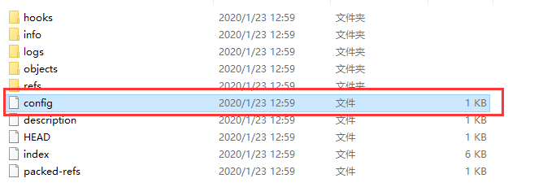
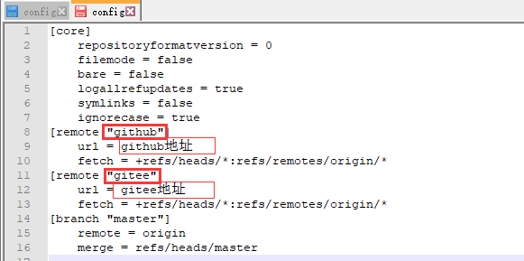
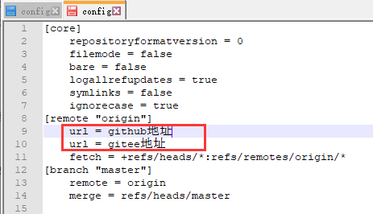

<h1 style="font-weight:bold;"><center>git学习笔记</center></h1>


# 第一章 常用命令


## 1.1 配置本地ssh

（1）设置git的用户名和邮箱（第一次安装git的情况下）

````shell
$ git config --global user.name "xxx"
$ git config --global user.email "xxxxx@xxx"
````

（2）生成密钥

````shell
$ ssh-keygen -t rsa -C "xxxxx@xx"
````

（3）连续3个回车，其中第三个回车前需要输入对应的登陆密码，完成后 `C:\Users\Administrator\\.ssh` 文件夹下会生成两个文件：`id_rsa` 和 `id_rsa.pub`

（4）将 `id_rsa.pub` 用记事本打开，复制里面的全部内容粘贴到 git 服务器上的添加 ssh 配置中即可。

## 1.2 git的基本操作流程

### 1.2.1 克隆远程仓库的代码

（1）克隆到本地

````shell
$ git clone https://xxx.github.com/xxx/xxx.git 
````

（2）克隆到本地指定文件夹 `project`

```shell
$ git clone https://xxx.github.com/xxx/xxx.git project
```

### 1.2.2 本地代码提交流程

（1）拉取远程仓库最新代码

````shell
$ git pull
````

（2）将本地新建的文件添加到远程仓库

```shell
$ git add .
```

（3）将本地修改后的文件提交到远程仓库

```shell
$ git commit -m "这里是注释"
```

（4）将本地修改后的文件推送到远程仓库

```shell
$ git push
```

## 1.3 tag的使用

（1）查看tag

```shell
$ git tag
```

（2）查看指定版本的tag（如查看v1.0开头的所有tag）

```shell
$ git tag -l 'v1.0*'
```

（3）显示tag信息

```shell
$ git show v1.0.0
```

（4）指定commit创建tag（如创建名为v1.0.1的tag）

```shell
$ git tag v1.0.1
```

（5）创建tag（如指定`54642b6204fa5714fa81dbe744f0ae6353977cd0`的commit创建名为`v1.0.1`的tag）

```shell
$ git tag -a v1.0.1 54642b6204fa5714fa81dbe744f0ae6353977cd0
```

- 查看commit使用命令 `$ git log`

（6）删除tag（如删除名为v1.0.1的tag）

```shell
$ git tag -d v1.0.1
```

（7）删除远程仓库的指定tag（如删除名为v1.0.1的tag）

```shell
$ git tag -d v1.0.1
$ git push origin :refs/tags/v1.0.1
```

（8）推送指定tag到远程仓库（如名为v1.0.1的tag）

```shell
$ git push origin v1.0.1
```

（9）推送本地所有tag到远程仓库

```shell
$ git push origin --tags
```

# 第二章 高级操作

## 2.1 电脑同时配置gitlab、github和gitee

### 2.1.1 生成密钥

（1）生成gitee密钥（指定文件名后缀防止覆盖）

````shell
ssh-keygen -t rsa -C "xxx@xx.com" -f ~/.ssh/id_rsa_gitee
````

（2）生成github密钥（指定文件名后缀防止覆盖）

````
ssh-keygen -t rsa -C "xxx@xx.com" -f ~/.ssh/id_rsa_github
````

（3）生成gitlab密钥（指定文件名后缀防止覆盖）

```
ssh-keygen -t rsa -C "xxx@xx.com" -f ~/.ssh/id_rsa_gitlab
```

（4）在`~/.ssh/`目录（.ssh在用户文件夹下）会分别生成`id_rsa_gitee`和`id_rsa_gitee.pub`私钥和公钥（还有github与gitlab对应私钥和公钥）。将`id_rsa_gitee.pub`中的全部内容复制粘帖到公司gitlab服务器的SSH-key的配置中。

### 2.1.2 添加config配置

（1）在`~/.ssh/`下添加config配置文件

````
cd ~/.ssh
touch config
````

（2）添加如下内容：

````
# gitlab                                                                       
Host gitlab
   Port 22
    User git
    HostName gitlab.com
    PreferredAuthentications publickey
    IdentityFile ~/.ssh/id_rsa_gitlab
# github                                                                           
Host github
    Port 22
    User git
    HostName github.com
    PreferredAuthentications publickey
    IdentityFile ~/.ssh/id_rsa_github
# gitee                                                                           
Host gitee
    Port 22
    User git
    HostName gitee.com
    PreferredAuthentications publickey
    IdentityFile ~/.ssh/id_rsa_gitee
````

配置文件字段对应解释：

````
Host 
它涵盖了下面一个段的配置，我们可以通过他来替代将要连接的服务器地址。这里可以使用任意字段或通配符。 
当ssh的时候如果服务器地址能匹配上这里Host指定的值，则Host下面指定的HostName将被作为最终的服务器地址使用，并且将使用该Host字段下面配置的所有自定义配置来覆盖默认的/etc/ssh/ssh_config配置信息。 
Port 
自定义的端口。默认为22，可不配置 
User 
自定义的用户名，默认为git，可不配置 
HostName 
真正连接的服务器地址 
PreferredAuthentications 
指定优先使用哪种方式验证，支持密码和秘钥验证方式 
IdentityFile 
指定本次连接使用的密钥文件
````

### 2.1.3 配置git仓库

由于公司使用gitlab进行代码管理，所以将gitlab设置为`global`全局配置（可根据自身情况选择设置）。

示例：

gitlba本地仓库文件夹为`F:/gitlab`，github本地仓库文件夹为`F:/github`，gitee本地仓库文件夹为`F:/gitee`。

则配置如下：

（1）先配置gitlab（防止把gitee和github本地仓库覆盖）

````
cd F:/gitlab
git init
git config --global user.name 'xxx'
git config --global user.email 'xxx@xx.com'
````

（2）配置github

```
cd F:/github
git init
git config --local user.name 'xxx'
git config --local user.email 'xxx@xx.com'
```

（3）配置gitee

```
cd F:/gitee
git init
git config --local user.name 'xxx'
git config --local user.email 'xxx@xx.com'
```

## 2.2 配置项目同时提交到github和gitee

**前提：已经在gitee上导入github项目。**


### 2.2.1 本地只有一个ssh-key的情况

**方法一：多次推送**

| 优点                           | 缺点                           |
| ------------------------------ | ------------------------------ |
| 可推送到指定的一个或多个仓库   | 推送仓库数量较多时，时间成本高 |
| 可不推送到指定的一个或多个仓库 |                                |

（1）通过执行过命令将本地项目和gitee项目关联**（步骤一和步骤二选一个执行即可）**

````
git remote add [name] [码云/github项目地址]

实例：
git remote add github https://github.com/DragonV96/order-system-seller.git
````

（2）通过修改本地项目的配置文件将本地项目和gitee项目关联**（步骤一和步骤二选一个执行即可）**

- 进入本地git项目文件夹


- 进入 `.git` 隐藏文件夹



- 编辑 `.git` 目录下的 `config` 文件（可以看到git给远程库起的默认名称是 `origin` ，但如果有多个远程库，则需要不同的名称来标识不同的远程库）



(3）执行命令查看配置的两个仓库

````shell
git remote
````

（4）推送代码时，需要**对两个仓库分别执行一次push命令**

````
git push github master
git push gitee master
````

**方法二：一次推送**

（1）通过命令将码云项目地址添加到本地已有的remote下**（步骤一和步骤二选一个执行即可）**

````
git remote set-url --add origin [码云项目地址]

实例：
git remote set-url --add origin https://gitee.com/glwsource/order-system-seller.git
````

（2）通过修改本地项目的配置文件**（步骤一和步骤二选一个执行即可）**



（3）推送只需一条命令

````
git push
````

（4）推送的时候可能会出现错误 `[rejected] master -> master (fetch first)`，此时执行强制推送命令

````
git push -f
````

（5）若步骤4仍然无法解决错误，则输入命令

````
git pull --rebase origin master
git push
````

### 2.2.2 本地有多个ssh-key的情况

