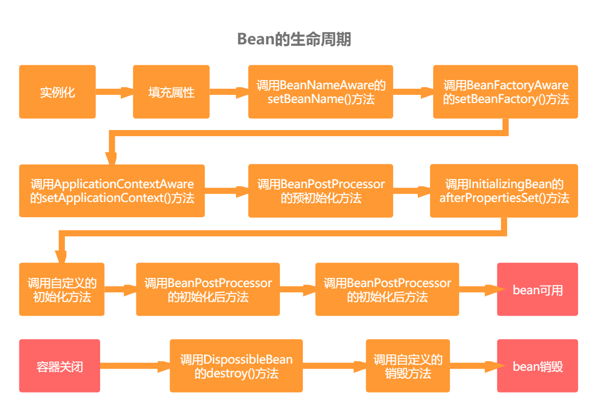

# Spring实战笔记

- 

## 1 Spring核心

Spring的核心是Spring容器。

### 1.1 Spring目标

Spring目标：简化 Java 开发，具体体现在：

- 基于 POJO 的轻量级和最小侵入性编程
- 通过依赖注入和面向接口实现松耦合
- 基于切面和惯例进行声明式编程
- 通过切面和模板减少样式代码

### 1.2 bean的三种装配机制

- XML 中显示配置
- Java 中显示配置
- 隐式的 bean 发现机制和自动装配

### 1.3 自动化装配bean

**1. 实现方式**

- 组件扫描（component scanning）：Spring会自动发现应用上下文中所创建的bean
- 自动装配（antowiring）：Spring自动满足bean之间的依赖

**2. 注解**

- `@ComponentScan` ：启用组件扫描
  - 不指定包路径默认扫描当前类所在的包及其所有子包路径（Spring默认不开启）
  - `(basePackages = "")` ：指定基础包
  - `(basePackageClasses = "")` 指定基础类或接口所在的包
- `@Component` ：声明为Spring组件
  - 不指定 bean 的 ID 则默认使用类名首字母小写的名称作为 ID

- `@Named` ：为bean设置ID（可替换 `@Component` ）
- `@Autowired` ：启用自动装配
- `@Inject` ：启用自动装配（可替换 `@Autowired` ）
- `@Bean` ：返回一个注册为 Spring 应用上下文的 bean 对象

依赖注入（DI，即Dependence Injection）

**1. 实现方式**

- 构造器注入
- Setter注入
- 接口注入

### bean的生命周期

