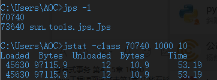
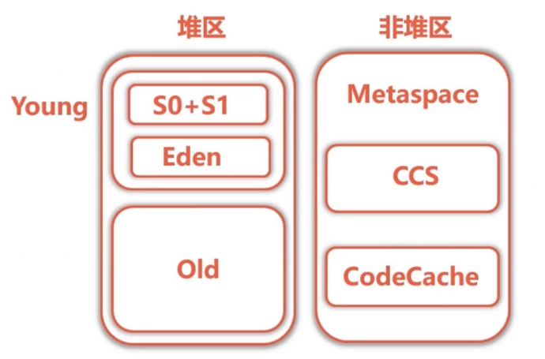
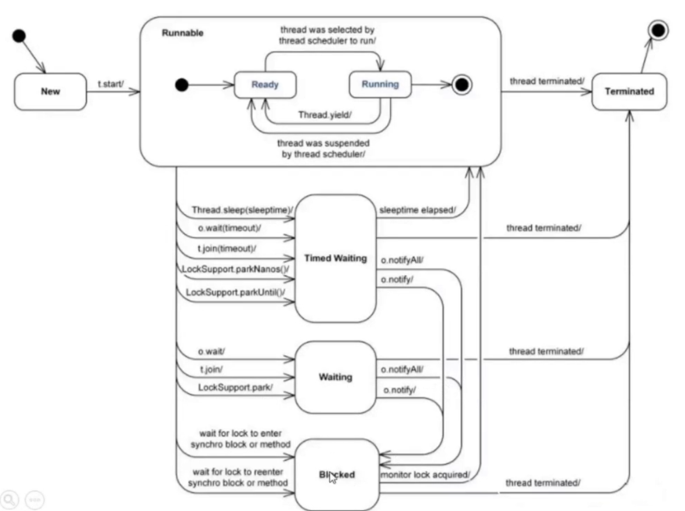

# 生产环境性能调优笔记

## 第一章 JDK命令行监控工具

### 1.1 JVM参数

**jvm工具文档地址：[点我](https://docs.oracle.com/javase/8/docs/technotes/tools/unix/index.html)**

#### 1.1.1 JVM参数类型

JVM参数类型分为**标准参数**、**X参数**和**XX参数**。

**1. 标准参数**

- -help
- -server -client
- -version -showversion
- -cp -classpath

````shell
示例：
java -version
````

**2. X参数**（非标准化参数，jdk版本不同可能参数不同）

- -Xint：解释执行
- -Xcomp：第一次使用则编译成本地代码
- -Xmixed：混合模式，JVM自己来决定是否编译成本地代码

**3. XX参数**（非标转化参数，相对不稳定，主要用于JVM调优和Debug）

- Boolean类型
  - 格式：`-XX:[+-]<name>` 表示启用（+）或者禁用（-）name属性
  - 实例：`-XX:+UseConcMarkSweepGC` 、`-XX:+UseG1GC`
- 非Boolean类型
  - 格式：`-XX:<name> = <value>` 表示name属性的值是value
  - 实例：`-XX:MaxGCPauseMillis=500` 、 `-XX:GCTimeRatio=19` 


**※注意：`-Xmx` 和 `-Xms` 不是X参数，而是XX参数。**

- `-Xmx` 等价于 `-XX:InitialHeapSize`
- `-Xms` 等价于 `-XX:MaxHeapSize`

#### 1.1.2 JVM运行时参数

- -XX:+PrintFlagsInitial
- -XX:+PrintFlagsFinal
- -XX:+UnlockExperimentalVMOptions 解锁实验参数
- -XX:+UnlockDiagnosticVMOptions 解锁诊断参数
- -XX:+PrintCommandLineFlags 打印命令行参数

````shell
示例：
java -XX:+PrintFlagsInitial -version
````

**※注意：`=` 表示默认值 `:=` 表示被用户或者JVM修改后的值。**

**1. PrintFlagsInitial 参数**


- `=` 表示默认值
- `:=` 表示被用户或者JVM修改后的值

**2. jps**

**文档对每个命令参数和结果参数都有具体说明： [文档地址](https://docs.oracle.com/javase/8/docs/technotes/tools/unix/jps.html#CHDCGECD)**

- `jps` 查看java进程
- `jps -l` 列出java进程包名

**3. jinfo**

**文档对每个命令参数和结果参数都有具体说明： [文档地址](https://docs.oracle.com/javase/8/docs/technotes/tools/unix/jinfo.html#BCGEBFDD)**

- 查看最大内存
  - `jinfo -flag MaxHeapSize [PID]`
- 查看垃圾回收器
  - `jinfo -flag UseConcMarkSweepGC [PID]` 是否启用KMS
  - `jinfo -flag UseG1GC [PID]` 是否使用了G1
  - `jinfo -flag UseParallelGC [PID]` 是否使用并行的垃圾回收器

#### 1.1.3 jstat查看JVM统计信息

**jstat文档对每个命令参数和结果参数都有具体说明： [文档地址](https://docs.oracle.com/javase/8/docs/technotes/tools/unix/jstat.html#BEHHGFAE)**

下面命令中的 `INTERVAL` 表示每隔多少毫秒打印一次， `COUNT` 表示打印多少次。

**1. 类装载**

- jstat -class [PID] [INTERVAL] [COUNT]

实例：



**2. 垃圾收集**

- jstat -gc [PID] [INTERVAL] [COUNT]
  - S0C、S1C、S0U、S1U 表示S0和S1的总量与使用量
  - EC、EU 表示Eden区总量与使用量
  - OC、OU 表示Old区总量与使用量
  - MC、MU 表示Meataspace区总量与使用量
  - CCSC、CCSU 表示压缩类空间总量与使用量
  - YGC、YGCT 表示YoungGC的次数与时间
  - FGC、FGCT 表示FullGC的次数与时间
  - GCT 表示总的GC时间
- jstat -gcutil [PID] [INTERVAL] [COUNT]
- jstat -gccause [PID] [INTERVAL] [COUNT]
- jstat -gcnew [PID] [INTERVAL] [COUNT]
- jstat -gcold [PID] [INTERVAL] [COUNT]


JVM的内存结构如下：（S0和S1空间大小一样，且在同一时间点一个为启用状态另一个为空）



**3. JIT编译**

- jstat -compiler [PID]  查看编译信息
- jstat -printcompilation [PID] 查看JVM HotSpot编译方法的统计信息

#### 1.1.4 导出内存映像文件

**1. 内存溢出自动导出**

- -XX:+HeapDumpOnOutOfMemoryError
- -XX:HeapDumpPath=./

**2. 使用 jmap 命令手动导出**

- -heap
- -clstats
- -dump:\<dump-options>
- -F

实例：（`jmap -dump:format=b,file=heap.hprof [PID]`）


#### 1.1.5 jstack查看线程状态

**jstack文档对每个命令参数和结果参数都有具体说明： [文档地址](https://docs.oracle.com/javase/8/docs/technotes/tools/unix/jstack.html#BABGJDIF)**

**线程生命周期图如下：**

