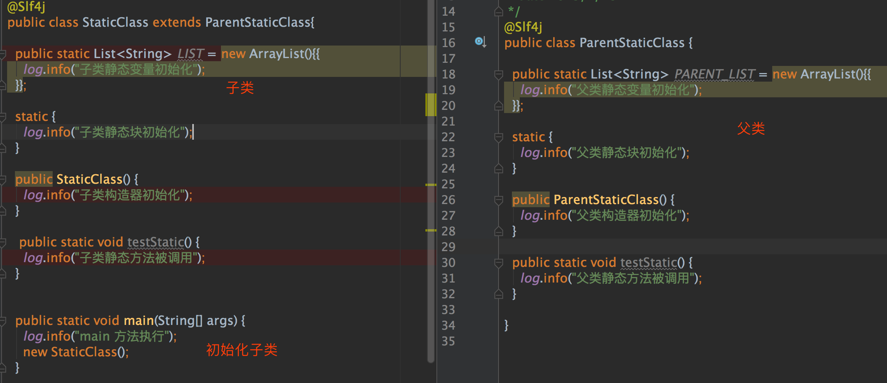
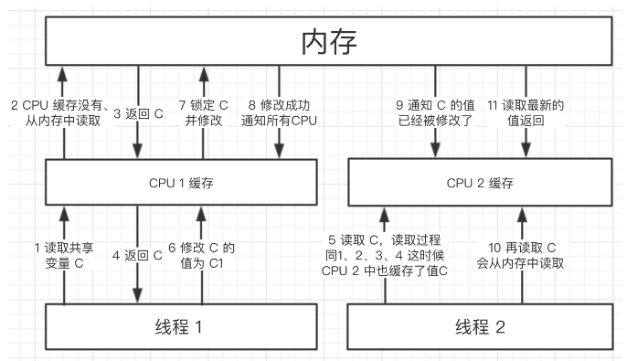
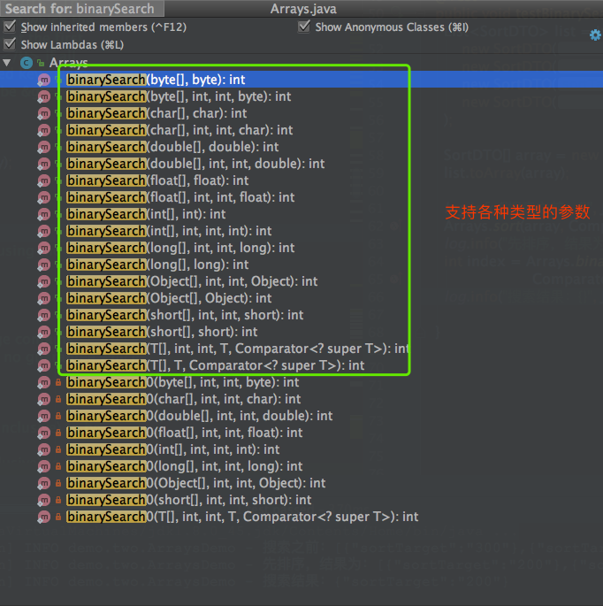
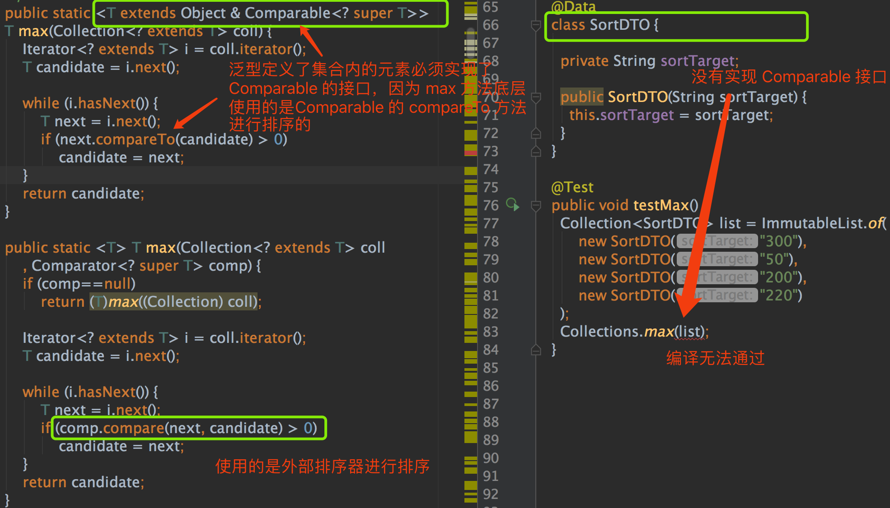
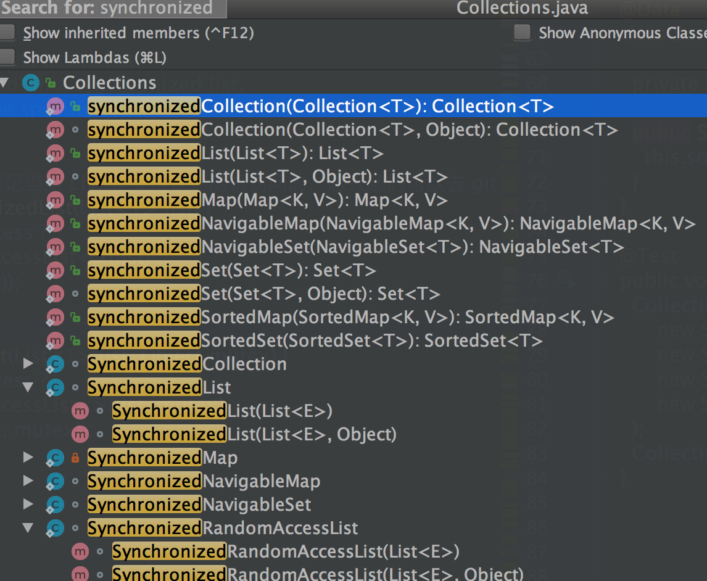
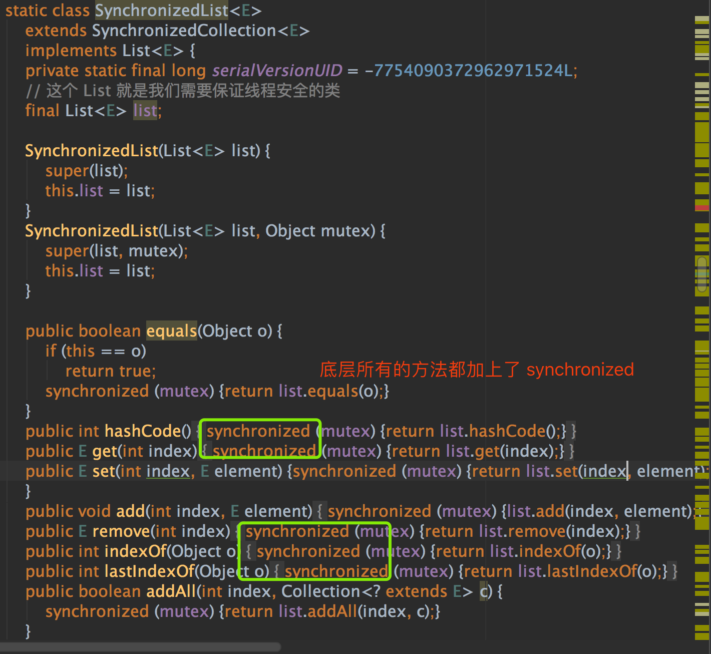
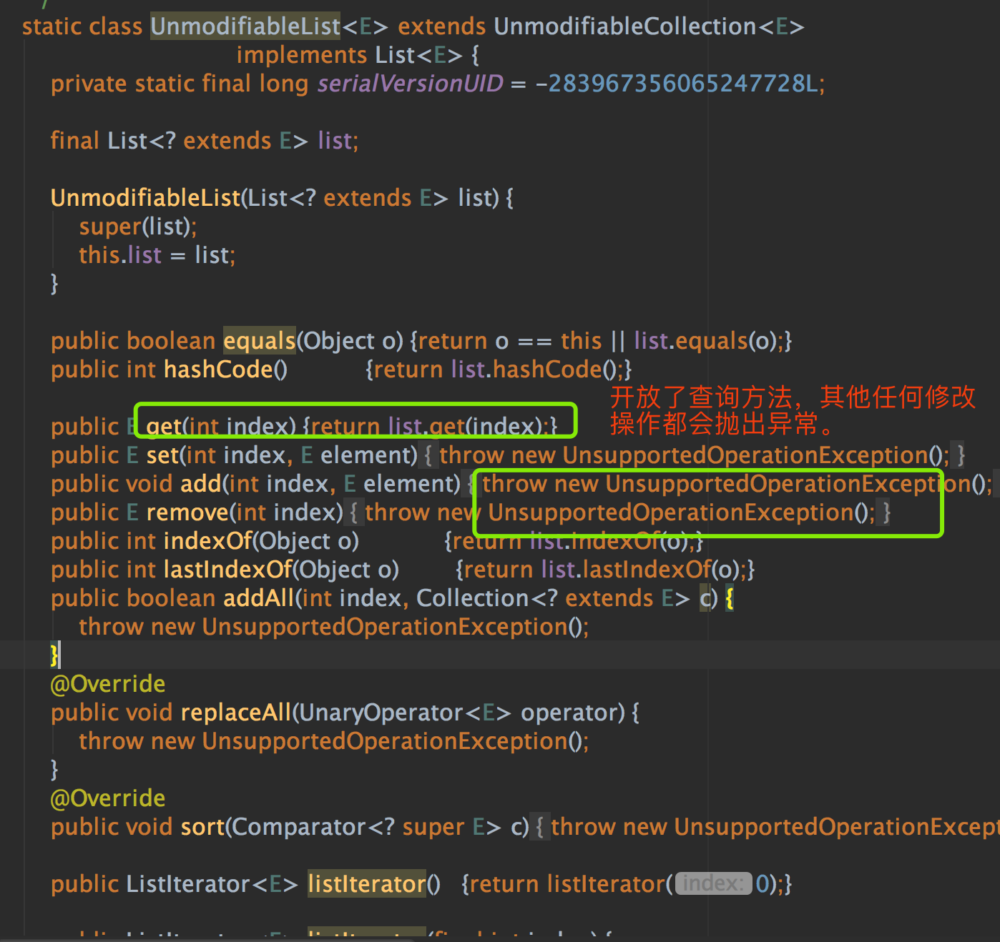
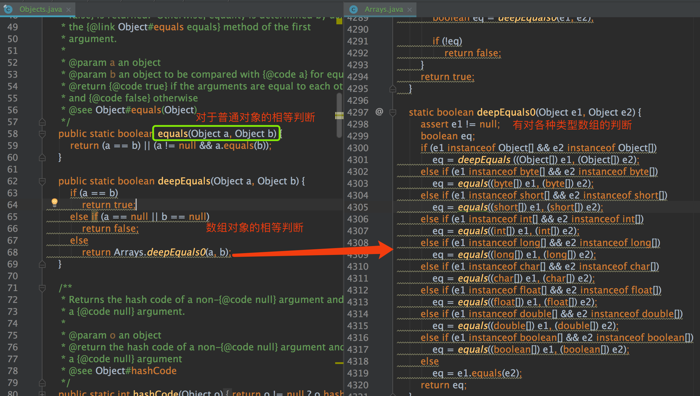
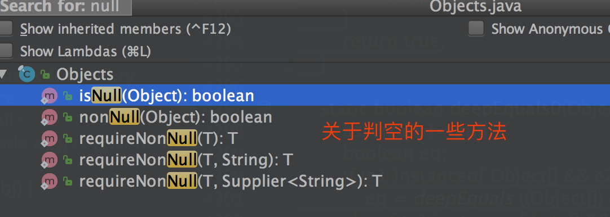

# java基础总结

  * [1 String、Long 源码解析和面试题](#1-stringlong-%E6%BA%90%E7%A0%81%E8%A7%A3%E6%9E%90%E5%92%8C%E9%9D%A2%E8%AF%95%E9%A2%98)
    * [1\.1 String](#11-string)
    * [1\.2 Long](#12-long)
    * [1\.3 面试题](#13-%E9%9D%A2%E8%AF%95%E9%A2%98)
  * [2 Java常用关键字理解](#2-java%E5%B8%B8%E7%94%A8%E5%85%B3%E9%94%AE%E5%AD%97%E7%90%86%E8%A7%A3)
    * [2\.1 static](#21-static)
    * [2\.2 final](#22-final)
    * [2\.3 try、catch、finally](#23-trycatchfinally)
    * [2\.4 volatile](#24-volatile)
    * [2\.5 transient](#25-transient)
    * [2\.6 default](#26-default)
    * [2\.7 面试题](#27-%E9%9D%A2%E8%AF%95%E9%A2%98)
  * [3 Arrays、Collections、Objects 常用方法源码解析](#3-arrayscollectionsobjects-%E5%B8%B8%E7%94%A8%E6%96%B9%E6%B3%95%E6%BA%90%E7%A0%81%E8%A7%A3%E6%9E%90)
    * [3\.1 工具类通用特征](#31-%E5%B7%A5%E5%85%B7%E7%B1%BB%E9%80%9A%E7%94%A8%E7%89%B9%E5%BE%81)
    * [3\.2 Arrays](#32-arrays)
    * [3\.3 Collections](#33-collections)
    * [3\.4 Objects](#34-objects)
    * [3\.5 面试题](#35-%E9%9D%A2%E8%AF%95%E9%A2%98)

## 1 String、Long 源码解析和面试题

### 1.1 String

**1. 不变性**

源码：

````java
public final class String
    implements java.io.Serializable, Comparable<String>, CharSequence {
    /** The value is used for character storage. */
    private final char value[];
}    
````

String类不变性的原因：

- String 被 final 修饰，所以String类不能被继承，类方法不能被覆写
- String中保存数据的是一个被final修饰的char型数组value，同时value是private权限的，String也未提供对value赋值的操作方法，所以value被赋值后，内存地址无法修改。

**2. 首字母大小写**

一般在反射逻辑中通常采用这种方法将类的首字母小写：

````java
public String getClassName(Class clazz) {
	String name = clazz.getClass().getName();
	return name.substring(0, 1).toLowerCase() + name.substring(1);
}
````

**3. 相等判断**

- equals（值相等判断）
- equalsIgnoreCase（值相等判断，忽略大小写）

equals源码：

````java
public boolean equals(Object anObject) {
    // 判断内存地址是否相同
    if (this == anObject) {
        return true;
    }
    // 待比较的对象是否是 String，如果不是 String，直接返回不相等
    if (anObject instanceof String) {
        String anotherString = (String)anObject;
        int n = value.length;
        // 两个字符串的长度是否相等，不等则直接返回不相等
        if (n == anotherString.value.length) {
            char v1[] = value;
            char v2[] = anotherString.value;
            int i = 0;
            // 依次比较每个字符是否相等，若有一个不等，直接返回不相等
            while (n-- != 0) {
                if (v1[i] != v2[i])
                    return false;
                i++;
            }
            return true;
        }
    }
    return false;
}
````

**4. 拆分和合并**

拆分：

String提供了split("str")方法，但是若有空值也会赋值给String数组的元素，如：

````java
	String a = ",a,b,";
	a.split(",");	——结果:["","a","","b"]
````

此时利用google开源工具包Guava可以解决：

````java
    String a =",a, ,  b  c ,";
    // Splitter 是 Guava 提供的 API 
    List<String> list = Splitter.on(',')
        .trimResults()// 去掉空格
        .omitEmptyStrings()// 去掉空值
        .splitToList(a);
    log.info("Guava 去掉空格的分割方法：{}",JSON.toJSONString(list));
    // 打印出的结果为：
    ["a","b  c"]
````

合并：

String提供了静态方法join，但是有两个局限性：

- 不支持依次join多个字符串，比如：`str.join(",", s1).join(",", s2)`最后得到的结果是是s2的值，s1的值被s2覆盖了
- 若join的是一个List对象，则无法自动过滤掉null值


此时利用google开源工具包Guava可以解决：

````java
    // 依次 join 多个字符串，Joiner 是 Guava 提供的 API
    Joiner joiner = Joiner.on(",").skipNulls();
    String result = joiner.join("hello",null,"china");
    log.info("依次 join 多个字符串:{}",result);

    List<String> list = Lists.newArrayList(new String[]{"hello","china",null});
    log.info("自动删除 list 中空值:{}",joiner.join(list));
    
	// 输出的结果为；
    依次 join 多个字符串:hello,china
	自动删除 list 中空值:hello,china
````

### 1.2 Long

**1. 缓存**

Long类中实现了一种缓存机制，缓存了从-128 ~ 127之间的所有Long值，如果取这个范围内的Long值，就不会初始化，而是直接从缓存种拿，下面是缓存初始化源码（Long的静态私有内部类）：

````java
private static class LongCache {
    private LongCache(){}
    // 缓存，范围从 -128 到 127，+1 是因为有个 0
    static final Long cache[] = new Long[-(-128) + 127 + 1];

    // 容器初始化时，进行加载
    static {
        // 缓存 Long 值，注意这里是 i - 128 ，所以再拿的时候就需要 + 128
        for(int i = 0; i < cache.length; i++)
            cache[i] = new Long(i - 128);
    }
}
````

Long从缓存取数值的源码：

````java
    public static Long valueOf(long l) {
            final int offset = 128;
            if (l >= -128 && l <= 127) { // will cache
                return LongCache.cache[(int)l + offset];
            }
            return new Long(l);
        }
````

### 1.3 面试题

**1）为什么使用 Long 时，大家推荐多使用 valueOf 方法，少使用 parseLong 方法？**

答：因为 Long 本身有缓存机制，缓存了 -128 到 127 范围内的 Long，valueOf 方法会从缓 

存中去拿值，如果命中缓存，会减少资源的开销，parseLong 方法就没有这个机制。

**2）如何解决 String 乱码的问题？**

答：乱码的问题的根源主要是两个：①字符集不支持复杂汉字；②二进制进行转化时字符集不匹配，所以在 String 乱码时我们可以这么做： 

- 所有可以指定字符集的地方强制指定字符集，比如 new String 和 getBytes 这两个地方； 

- 我们应该使用 UTF-8 这种能完整支持复杂汉字的字符集。

**3）为什么大家都说 String 是不可变的**

答：主要是因为 String 和保存数据的 char 数组，都被 final 关键字所修饰，所以是不可变的。

**4）String 一些常用操作问题，如问如何分割、合并、替换、删除、截取等等问题** 

答：分割：split()；

​		合并：join()；

​		替换replace()；

​		删除replace()种的替换字符串传""即可；

​		截取：substring()。

**5）为什么把String设计为不可变对象**

答：不可变的好处：①方便使用字符串常量池，节省系统资源；

​									②避免了引用传递，是线程安全的。

​		不可变的实现原理： String 和保存数据的 char 数组，都被 final 关键字所修饰。

## 2 Java常用关键字理解

### 2.1 static

被static修饰的只有类变量、方法和方法块，修饰后具有静态、全局属性，同时会出现并发读写的线程安全性问题。

**1. static修饰变量**

若定义了：`public static List<String> list = new ArrayList();`这样的共享变量，如果同时被多个线程访问的话，就有线程安全的问题，有两种解决办法：

- 把线程不安全的ArrayList换成线程安全的CopyOnWriteArrayList
- 每次访问时，手动加锁		

**2. static修饰方法**

当方法被`public static`修饰时：

1）代表该方法和当前类时无关的，任何类都可以直接访问。

2）该方法内部只能调用同样被 static 修饰的方法，不能调用普通方法，（常用的 util 类里面的各种方法，用 static 修，好处就是调用特别方便。）

3）static 方法内部的变量在执行时是没有线程安全问题的。方法执行时，数据运行在栈里面，栈的数据每个线程都是隔离开的，所以不会有线程安全的问题，所以 util 类的各个 static 方法是可以安全使用的。

**3. static修饰方法块**

被static修饰的方法块叫做静态块，静态块在类启动之前，且静态块只能调用被static修饰的变量，且此变量必须写在静态块之前。

**4. static初始化顺序**

被 static 修饰的类变量、方法块和静态方法的初始化时机的测试 demo，如下图：



打印结果：

​		1 父类静态变量初始化

​		2 父类静态块初始化

​		3 子类静态变量初始化

​		4 子类静态块初始化

​		5 main 方法执行

​		6 父类构造器初始化

​		7 子类构造器初始化

结论：①父类的静态变量和静态块比子类优先初始化；

​			②静态变量和静态块比类构造器优先初始化；

​			③被 static 修饰的方法，在类初始化的时候并不会初始化，只有当自己被调用时，才会被执行。

### 2.2 final

final表示不可改变的。

**被final修饰的场景**

- 类：表示该类无法被继承

- 方法：表示该类无法被覆写（Override）

- 变量：表示该变量声明时初始化完成，此后不能再修改其内存地址

  ※注意：对于List、Map集合这些类，被final修饰后可以改变其内部的值，但是无法修改初始化时的内存地址。

### 2.3 try、catch、finally

- try：确定代码执行的范围
- catch：捕捉可能发生的异常
- finnaly：必须执行的代码块

代码演示：

````java
public void testCatchFinally() {
  try {
    log.info("try is run");
    if (true) {
      throw new RuntimeException("try exception");
    }
  } catch (Exception e) {
    log.info("catch is run");
    if (true) {
      throw new RuntimeException("catch exception");
    }
  } finally {
    log.info("finally is run");
  }
}
````

输出结果：


流程分析：

（1）finally先执行后，再抛出catch的异常；

（2）最终捕获的异常是catch的异常，try抛出来的异常已被catch掉了。

### 2.4 volatile

volatile表示可见的，常用来修饰**共享变量**

作用：当共享变量的值被修改后，会及时通知到其他线程当前共享变量的值已被修改。

**【附加基础】**

在多核CPU下，线程在拿值时为提高效率，是直接和CPU缓存打交道的，而不是内存。主要是因为CPU缓存执行速度更快。（比如线程要拿C的值，会直接从CPU的缓存中拿，CPU缓存中没有，则从内存中拿，所以**线程的读操作永远都是拿CPU缓存的值**）

此时会产生一个问题，CPU缓存中的值和内存中的值可能并不是时刻都是同步的，导致线程计算的值可能不是最新的，共享变量的值有可能已经被其他线程修改掉了，但此时修改的是机器内存的值，而CPU缓存的值还是老的，导致其他线程的计算结果出错。

此时有个机制被触发，内存会主动通知CPU缓存，当前共享变量的值已经失效了，需要重新拉取最新的值，CPU缓存就会重新从内存中去拿值。

volatile关键字就会触发这种机制，加了volatile关键字的变量，就被会识别为共享变量，内存中值被修改后，会通知到各个CPU缓存，使CPU缓存中的值也对应被修改，从而保证线程从CPU缓存中拿出来的值是最新的。

volatile机制图例说明：



图中，线程1和线程2刚开始同时读取C的值，CPU1和CPU2缓存中同时有了C值，此时线程1把C的值修改了，内存的值和CPU2缓存中的C值就不相同了，内存发现C的值被volatile关键字修饰（C为共享变量），立马使CPU2缓存中的C值状态置为无效，通知CPU2从内存中重新拉取最新的C值，这时线程2再来读取C的值时，C已是最新值。

### 2.5 transient

transient通常用来修饰类变量，表示当前变量无需进行序列化。

实体类序列化时，会自动忽略被transient修饰的属性。

### 2.6 default

default 常用在接口的方法上，表示子类无需强制实现该方法，但是必须有默认实现。


### 2.7 面试题

**1）如何证明static静态变量和类无关**

答：①无需初始化类即可直接使用静态变量

​		②在任意类的main方法中，即使不写初始化类的代码，静态变量都会自动初始化

​		③静态变量只会初始化一次，初始化完成后，无论再new出多少类，静态变量都不会再初始化。

**2）常常看见变量和方法被static与final两个关键字修饰，为什么这么做？**

答：①变量和方法与类无关，可直接使用，使用比较方便

​		②强调变量内存地址不可变，方法不可被继承覆写，强调了方法内部的稳定性。

**3）catch中发生了未知异常，finally还会执行么？**

答：会，catch发生异常，finally照样会执行，并且是finally执行完成后，才会抛出catch中的异常。

​		catch会吃掉try中抛出的异常，为了避免这种情况，在某些可预见的catch中会发生异常的地方，先把try抛出的异常打印出来，方便从日志中查看完整异常从而排查问题。

**4）volatile关键字的作用和原理**

答：作用：被修饰的变量变成共享变量，此时若变量的值被改变，会及时通知到其他线程上。

原理：被volatile修饰的共享变量一旦值被改变，内存会主动通知到各个CPU缓存，使CPU缓存中的值也对应被修改，从而保证线程从CPU缓存中拿出来的值始终是最新的。

## 3 Arrays、Collections、Objects 常用方法源码解析

### 3.1 工具类通用特征

好的工具类的通用特征：

- 构造器必须是私有的。（私有构造器的工具类无法被new出来，因为工具类在使用的时候，需要满足无需初始直接使用）

- 工具类的工具方法必须被static、final关键字修饰。（可保证方法不可变，并且可方便的直接使用）

	※注意：尽量不在工具方法中，对共享变量做修改的操作访问（若必须要做务必加锁），否则会产生线程安全问题。除此之外，工具类方法本身是没有线程安全问题的，可放心使用。

### 3.2 Arrays

Arrays 主要对数组提供了一些比较高效的操作，如排序、查找、填充、拷贝、相等判断等。

**1）二分查找法**

`Arrays.binarySearch` 方法主要用于快速从数组中查找出对应的值，返回参数是数组下标值，若查不到则返回负数。



需要注意：

- 如果被搜索的数组是无序的，必须先排序，否则二分搜索可能搜不到。
- 搜索方法返回的数组的下标值，若搜不到则返回负数，此时需要对数组下标值进行负判断，否则直接使用负数的下标值会报数组越界错误。

二分底层代码的实现：

````java
// a：我们要搜索的数组，fromIndex：从那里开始搜索，默认是0； toIndex：搜索到何时停止，默认是数组大小
// key：我们需要搜索的值 c：外部比较器
private static <T> int binarySearch0(T[] a, int fromIndex, int toIndex,
                                     T key, Comparator<? super T> c) {
    // 如果比较器 c 是空的，直接使用 key 的 Comparable.compareTo 方法进行排序
    // 假设 key 类型是 String 类型，String 默认实现了 Comparable 接口，就可以直接使用 compareTo 方法进行排序
    if (c == null) {
        // 这是另外一个方法，使用内部排序器进行比较的方法
        return binarySearch0(a, fromIndex, toIndex, key);
    }
    int low = fromIndex;
    int high = toIndex - 1;
    // 开始位置小于结束位置，就会一直循环搜索
    while (low <= high) {
        // 假设 low =0，high =10，那么 mid 就是 5，所以说二分的意思主要在这里，每次都是计算索引的中间值
        int mid = (low + high) >>> 1;
        T midVal = a[mid];
        // 比较数组中间值和给定的值的大小关系
        int cmp = c.compare(midVal, key);
        // 如果数组中间值小于给定的值，说明我们要找的值在中间值的右边
        if (cmp < 0)
            low = mid + 1;
        // 我们要找的值在中间值的左边
        else if (cmp > 0)
            high = mid - 1;
        else
        // 找到了
            return mid; // key found
    }
    // 返回的值是负数，表示没有找到
    return -(low + 1);  // key not found.
}
````

**2）拷贝**

数组拷贝很常见，入 `ArrayList` 在执行 `add` （扩容）或 `remove` （删除元素不是最后一个）操作时，会进行拷贝。拷贝整个数组可以使用 `copyOf` 方法，拷贝部分可以用 `copyOfRange` 方法，下面是 `copyOfRange` 底层源码实现。

````java
// original 原始数组数据
// from 拷贝起点
// to 拷贝终点
public static char[] copyOfRange(char[] original, int from, int to) {
    // 需要拷贝的长度
    int newLength = to - from;
    if (newLength < 0)
        throw new IllegalArgumentException(from + " > " + to);
    // 初始化新数组
    char[] copy = new char[newLength];
    // 调用 native 方法进行拷贝，参数的意思分别是：
    // 被拷贝的数组、从数组那里开始、目标数组、从目的数组那里开始拷贝、拷贝的长度
    System.arraycopy(original, from, copy, 0,
                     Math.min(original.length - from, newLength));
    return copy;
}
````

实际上底层调用的是 `System.arraycopy` 这个 `native` 方法。

### 3.3 Collections

Collections 是为了方便使用集合的工具类。（Arrays 是方便数组使用的工具类）

Collections 提供了 `sort` 和 `binarySearch` 方法

**1）求集合中的最大/小值**



- max 方法泛型 T 必须继承 `Object` 类并实现 `Comparable` 接口
- 自定义类实现 `Comparable` 接口和传入外部排序器

**2）线程安全的集合**



线程安全的集合方法都是 `synchronized` 开头的，底层通过 `synchronized` 轻量锁来实现的，下面是 `synchronizedList` 类的底层实现。



`synchronizedList` 类的所有操作方法都加上了 `synchronized` 锁，所以是线程安全的。

**3）不可变集合**

不可变集合的类都是以 `Unmodifiable` 开头的。从原集合中得到的一个不可变的新集合后，此新集合**只能访问，无法修改**；一旦修改则会抛出异常。不可变集合只开放了查询方法，其余任何修改操作都会抛出 `UnsupportedOperationException` 异常，下面是 `UnmodifiableList` 类的源码。



### 3.4 Objects

Object类是所有类的父类，常用到的两个方法就是相等判断和空判断。

**1）相等判断**

Objects提供 `equals` 和 `deepEquals` 两个方法来进行相等判断

- equals 判断基本类型和自定义类
- deepEquals 用来判断数组的类型



**2）为空判断**



上图是 `Object` 类的为空判断方法

- isNull 对于对象是否为空返回对应的 `boolean` 值
- requireNonNull 方法更加严格，如果一旦为空，则会抛出异常

### 3.5 面试题

**1）工作中有哪些好用的工具类，如何写好一个工具类？**

答：好用的工具类：如Arrays的排序、二分查找、Collection的不可变/线程安全集合类、Objects的判空相等判断等工具类。

如何写好：工具类满足①工具类构造器必须私有；②使用static final关键字对方法进行修饰。

**2）写一个二分查找算法的实现**

答：见代码（jdk的Arrays工具类中的binarySearch方法源码）

````java
// a：我们要搜索的数组，fromIndex：从那里开始搜索，默认是0； toIndex：搜索到何时停止，默认是数组大小
// key：我们需要搜索的值 c：外部比较器
private static <T> int binarySearch0(T[] a, int fromIndex, int toIndex,
                                     T key, Comparator<? super T> c) {
    // 如果比较器 c 是空的，直接使用 key 的 Comparable.compareTo 方法进行排序
    // 假设 key 类型是 String 类型，String 默认实现了 Comparable 接口，就可以直接使用 compareTo 方法进行排序
    if (c == null) {
        // 这是另外一个方法，使用内部排序器进行比较的方法
        return binarySearch0(a, fromIndex, toIndex, key);
    }
    int low = fromIndex;
    int high = toIndex - 1;
    // 开始位置小于结束位置，就会一直循环搜索
    while (low <= high) {
        // 假设 low =0，high =10，那么 mid 就是 5，所以说二分的意思主要在这里，每次都是计算索引的中间值
        int mid = (low + high) >>> 1;
        T midVal = a[mid];
        // 比较数组中间值和给定的值的大小关系
        int cmp = c.compare(midVal, key);
        // 如果数组中间值小于给定的值，说明我们要找的值在中间值的右边
        if (cmp < 0)
            low = mid + 1;
        // 我们要找的值在中间值的左边
        else if (cmp > 0)
            high = mid - 1;
        else
        // 找到了
            return mid; // key found
    }
    // 返回的值是负数，表示没有找到
    return -(low + 1);  // key not found.
}
````

**3）如果我希望ArrayList初始化之后，不能为修改，怎么做？**

答：使用Collections的unmodifiableList的方法，该方法会返回一个不能被修改的内部类集合，这些集合类值开放查询的方法，其他方法重写了，调用则会直接抛出 `UnsupportedOperationException` 异常。
