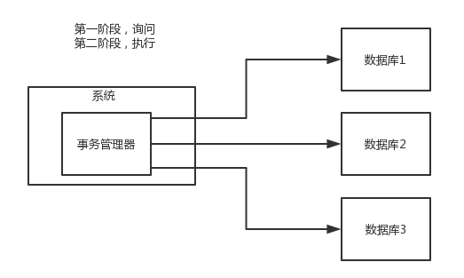

# 分布式事务学习笔记

## 1 事务基本概念

### 1.1 事务概念

事务是一种以**可靠、一致**的方式，**访问和操作**数据库中数据的**程序单元**。

### 1.2 事务原则

- 原子性
- 一致性
- 隔离性
- 持久性

## 2 分布式事务

分布式事务的实现方式主要有以下5种：

- XA 方案
- TCC 方案
- 本地消息表
- 可靠消息最终一致性方案
- 最大努力通知方案

### 2.1 XA 方案

#### 2.1.1 概念

XA 方案，即两阶段提交方案。

有一个**事务管理器**的概念，负责协调多个数据库（资源管理器）的事务，事务管理器先问问各个数据库你准备好了吗？如果每个数据库都回复 ok，那么就正式提交事务，在各个数据库上执行操作；如果任何其中一个数据库回答不 ok，那么就回滚事务。

#### 2.1.2 执行流程图

#### 2.1.3 特性

**1. 优点**

- 开发上手简单

**2. 缺点**

- 效率很低，因为严重依赖于数据库层面来搞定复杂的事务
- 不适合高并发的场景
- 违反微服务架构的规范，因为需要直连别的服务的库（随便交叉胡乱访问，几百个服务的话，全体乱套）

#### 2.1.4 适用场景

适合单块应用里，跨多个库的分布式事务。

> 几乎很少使用。

### 2.2 TCC 方案

#### 2.2.1 概念

TCC 的全称是： `Try` 、 `Confirm` 、 `Cancel` 。

- Try 阶段：对各个服务的资源做检测以及对资源进行**锁定或者预留**
- Confirm 阶段：在各个服务中**执行实际的操作**
- Cancel 阶段：如果任何一个服务的业务方法执行出错，那么这里就需要**进行补偿**，就是执行已经执行成功的业务逻辑的回滚操作。（把那些执行成功的回滚）

#### 2.2.2 执行流程图

#### 2.2.3 特性

**1. 优点**

- 严格保证分布式事务最终一致性（严格保证资金的正确性，保证在资金上不会出现问题）

**2. 缺点**

- 维护难度极高，补偿代码巨大（因为这个**事务回滚**实际上是**严重依赖于自己写代码来回滚和补偿**）

#### 2.2.4 适用场景

**支付**、**交易**相关的场景。

> 除了跟钱相关的，几乎很少使用。

### 2.3 本地消息表

#### 2.3.1 概念

来源于国外的 ebay 。

流程：

1）A 系统在自己本地一个事务里操作同时，插入一条数据到消息表

2）接着 A 系统将这个消息发送到 MQ 中去

3）B 系统接收到消息之后，在一个事务里，往自己本地消息表里插入一条数据，同时执行其他的业务操作，如果这个消息已经被处理过了，那么此时这个事务会回滚，这样**保证不会重复处理消息**

4）B 系统执行成功之后，就会更新自己本地消息表的状态以及 A 系统消息表的状态

5）如果 B 系统处理失败了，那么就不会更新消息表状态，那么此时 A 系统会定时扫描自己的消息表，如果有未处理的消息，会再次发送到 MQ 中去，让 B 再次处理

6）这个方案保证了最终一致性，哪怕 B 事务失败了，但是 A 会不断重发消息，直到 B 那边成功为止

#### 2.3.2 执行流程图

#### 2.3.3 特性

**1. 优点**

- 保证了分布式事务的最终一致性

**2. 缺点**

- 不适合高并发的场景，**严重依赖于数据库的消息表来管理事务**
- 扩展性差

#### 2.3.4 适用场景

几乎很少使用。

> 几乎很少使用。

### 2.4 可靠消息最终一致性方案

#### 2.4.1 概念

直接基于 MQ 来实现事务。（比如阿里的 RocketMQ 就支持消息事务）

流程：

1）A 系统先发送一个 prepared 消息到 mq，如果这个 prepared 消息发送失败那么就直接取消操作别执行了

2）如果这个消息发送成功过了，那么接着执行本地事务，如果成功就告诉 mq 发送确认消息，如果失败就告诉 mq 回滚消息

3）如果发送了确认消息，那么此时 B 系统会接收到确认消息，然后执行本地的事务

4）mq 会自动**定时轮询**所有 prepared 消息回调你的接口，问你，这个消息是不是本地事务处理失败了，所有没发送确认的消息，是继续重试还是回滚？一般来说这里你就可以查下数据库看之前本地事务是否执行，如果回滚了，那么这里也回滚吧。这个就是避免可能本地事务执行成功了，而确认消息却发送失败了

5）这个方案里，要是系统 B 的事务失败了咋办？重试咯，自动不断重试直到成功，如果实在是不行，要么就是针对重要的资金类业务进行回滚，比如 B 系统本地回滚后，想办法通知系统 A 也回滚；或者是发送报警由人工来手工回滚和补偿

> 目前国内互联网公司大都是这么玩，要不就用 RocketMQ 支持的，要不就自己基于类似 ActiveMQ？RabbitMQ？自己封装一套类似的逻辑出来。

#### 2.4.2 执行流程图

#### 2.4.3 特性

**1. 优点**

- 框架集成，上手简单
- 保证最终一致性
- 自带补偿重试机制

**2. 缺点**

- 部分场景需要人工手动回滚和补偿

#### 2.4.4 适用场景

主流分布式场景都适合。

### 2.5 最大努力通知方案

#### 2.5.1 概念

流程：

1）系统 A 本地事务执行完之后，发送个消息到 MQ

2）这里会有个专门消费 MQ 的**最大努力通知服务**，这个服务会消费 MQ 然后写入数据库中记录下来，或者是放入个内存队列也可以，接着调用系统 B 的接口

3）要是系统 B 执行成功就 ok 了；要是系统 B 执行失败了，那么最大努力通知服务就定时尝试重新调用系统 B，反复 N 次，最后还是不行就放弃

#### 2.5.2 特性

**1. 优点**

- 并发大

**2. 缺点**

- 不保证数据最终一致性

#### 2.5.3 适用场景

适用于对数据一致性要求较低，且并发较大的场景。