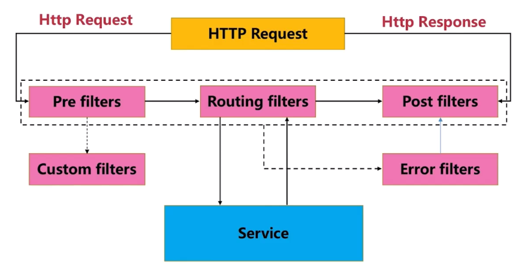

# Spring Cloud学习笔记

## 1 Spring Cloud概述

### 1.1 微服务

微服务是可以独立部署、水平扩展、独立访问（或者有独立的数据库）的服务单元。

### 1.2 Spring Cloud基本概念

Spring Cloud 是一系列框架的有序集合。

Spring Cloud 利用 Spring Boot 的开发便利性巧妙地简化了分布式系统基础设施的开发，如服务发现注册、配置中心、消息总线、负载均衡、断路器、数据监控等，都可以用 Spring Boot 的开发风格做到一键启动和部署。

它将目前各家公司开发的比较成熟、经得起实际考验的服务框架组合起来，通过 Spring Boot 风格进行再封装屏蔽掉了复杂的配置和实现原理，最终给开发者留出了一套简单易懂、易部署和易维护的分布式系统开发工具包。

### 1.3 Spring Cloud核心组件

- **Spring Cloud Netflix**

​	重要组件之一，与各种Netflix OSS组件集成，组成微服务的核心。

- **Netflix Eureka**

  服务注册中心，云端服务发现，一个基于 REST 的服务，用于定位服务，以实现云端中间层服务发现和故障转移。

- **Netflix Hystrix**

  熔断器，容错管理工具，旨在通过熔断机制控制服务和第三方库的节点,从而对延迟和故障提供更强大的容错能力。

- **Netflix Zuul**

  Zuul 是在云平台上提供动态路由,监控,弹性,安全等边缘服务的框架。

- **Netflix Archaius**

  配置管理API，包含一系列配置管理API，提供动态类型化属性、线程安全配置操作、轮询框架、回调机制等功能。（可实现动态获取配置， 原理是每隔60s（默认，可配置）从配置源读取一次内容，这样修改了配置文件后不需要重启服务就可以使修改后的内容生效，前提使用archaius的API来读取。）

- **Spring Cloud Config**

​	配置中心，配置管理工具包，可以把配置放到远程服务器，集中化管理集群配置，目前支持本地存储、Git 以及 Svn。

- **Spring Cloud Bus**

​	事件、消息总线，用于在集群（例如，配置变化事件）中传播状态变化，可与Spring Cloud Config联合实现热部署。

- **Spring Cloud for Cloud Foundry**

​	Cloud Foundry是VMware推出的业界第一个开源PaaS云平台，它支持多种框架、语言、运行时环境、云平台及应用服务，使开发人员能够在几秒钟内进行应用程序的部署和扩展，无需担心任何基础架构的问题。

- **Spring Cloud Cluster**

​	Spring Cloud Cluster将取代Spring Integration。提供在分布式系统中的集群所需要的基础功能支持，如：选举、集群的状态一致性、全局锁、tokens等常见状态模式的抽象和实现。

- **Spring Cloud Consul**

​	Spring Cloud Consul 封装了Consul操作，consul是一个服务发现与配置工具，与Docker容器可以无缝集成。（Consul 是一个支持多数据中心分布式高可用的服务发现和配置共享的服务软件,由 HashiCorp 公司用 Go 语言开发, 基于 Mozilla Public License 2.0 的协议进行开源，Consul 支持健康检查,并允许 HTTP 和 DNS 协议调用 API 存储键值对。）

### 1.4 Spring Cloud其他组件

- **Spring Cloud Security**

​	基于 Spring security 的安全工具包，为应用程序添加安全控制。

- **Spring Cloud Sleuth**

​	日志收集工具包，封装了 Dapper 和 log-based 追踪以及 Zipkin 和 HTrace 操作，为 Spring Cloud 应用实现了一种分布式追踪解决方案。

- **Spring Cloud Data Flow**
    - 用于开发和执行大范围数据处理其模式包括ETL，批量运算和持续运算的统一编程模型和托管服务。
    - 是一个原生云可编配的服务。使用Spring Cloud data flow，开发者可以为像数据抽取，实时分析，和数据导入/导出这种常见用例创建和编配数据通道 （data pipelines）。
    - Spring Cloud data flow 是基于原生云对 spring XD的重新设计，该项目目标是简化大数据应用的开发。
    - Spring Cloud data flow 为基于微服务的分布式流处理和批处理数据通道提供了一系列模型和最佳实践。

- **Spring Cloud Stream**

​	Spring Cloud Stream是创建消息驱动微服务应用的框架。用来建立单独的／工业级spring应用，使用spring integration提供与消息代理之间的连接。数据流操作开发包，封装了与Redis,Rabbit、Kafka等发送接收消息。

- **Spring Cloud Task**

​	Spring Cloud Task 主要解决短命微服务的任务管理，任务调度的工作。

- **Spring Cloud Zookeeper**

​	操作Zookeeper的工具包，用于使用zookeeper方式进行服务发现和配置管理。

- **Spring Cloud Connectors**

​	简化了连接到服务的过程和从云平台获取操作的过程，有很强的扩展性，可利用Spring Cloud Connectors来构建自己的云平台。便于云端应用程序在各种PaaS平台连接到后端，如：数据库和消息代理服务。

- **Spring Cloud Starters**

​	为Spring Cloud提供开箱即用的依赖管理。

- **Spring Cloud CLI**

​	基于 Spring Boot CLI，可以以命令行方式快速建立云组件。

### 1.5 与Spring Boot的关系

spring -> spring Boot > Spring Cloud（->表示依赖关系）

- Spring Boot 是 Spring 的一套快速配置脚手架，可以基于 Spring Boot 快速开发单个微服务，Spring Cloud 是一个基于 Spring Boot 实现的云应用开发工具；
- Spring Boot 专注于快速、方便集成的单个个体，Spring Cloud是关注全局的服务治理框架；
- Spring Boot 使用了默认大于配置的理念，很多集成方案已经选择好了，能不配置就不配置，Spring Cloud很大的一部分是基于 Spring Boot 来实现,
- Spring Boot 可以离开 Spring Cloud 独立使用开发项目，但是 Spring Cloud 离不开 Spring Boot。他们属于依赖的关系。

## 2 注册中心

### 2.1 Eureka

### 2.1.1 基本概念

**1. 概念**

Eureka 是 Netflix 开源的一款提供服务注册和发现的产品，它提供了完整的 Service Registry 和 Service Discovery 实现。也是 springcloud 体系中最重要最核心的组件之一。

> 服务中心又称注册中心，管理各种服务功能包括服务的注册、发现、熔断、负载、降级等。

**2. 组成**

​	Eureka由两个组件组成：Eureka服务器和Eureka客户端。

​	Eureka服务器用作服务注册服务器。Eureka客户端是一个java客户端，用来简化与服务器的交互、作为轮询负载均衡器，并提供服务的故障切换支持。

​	上图简要描述了Eureka的基本架构，由3个角色组成：

- Eureka Server

  提供服务注册和发现

- Service Provider

  服务提供方：将自身服务注册到Eureka，从而使服务消费方能够找到

- Service Consumer

  服务消费方：从Eureka获取注册服务列表，从而能够消费服务

​	**注册中心必须集群搭建，否则遇到故障对整个生产环境的打击是毁灭性的。**

​	生产环境中需要三台或者大于三台的注册中心来保证服务的稳定性，配置的原理是将当前注册中心分别指向其它的所有的注册中心。

## 3 服务调用

## 4 熔断器Hystrix

​	熔断器（CircuitBreaker）：实现快速失败。若它在一段时间内侦测到许多类似的错误，会强迫其以后的多个调用快速失败，不再访问远程服务器，从而防止应用程序不断地尝试执行可能会失败的操作，使得应用程序继续执行而不用等待修正错误，或者浪费CPU时间去等到长时间的超时产生。

​	熔断器也可以使应用程序能够诊断错误是否已经修正，如果已经修正，应用程序会再次尝试调用操作。

​	**熔断器就是保护服务高可用的最后一道防线。**

### 4.1 Hystrix特性

​	**1. 断路器机制**

​	当Hystrix Command请求后端服务失败数量超过一定比例(默认50%), 断路器会切换到开路状态(Open). 这时所有请求会直接失败而不会发送到后端服务. 断路器保持在开路状态一段时间后(默认5秒), 自动切换到半开路状态(HALF-OPEN). 这时会判断下一次请求的返回情况, 如果请求成功, 断路器切回闭路状态(CLOSED), 否则重新切换到开路状态(OPEN)。

​	一旦后端服务不可用, 断路器会直接切断请求链, 避免发送大量无效请求影响系统吞吐量, 并且断路器有自我检测并恢复的能力。

​	**2. Fallback**

​	Fallback相当于是降级操作。对于查询操作, 可实现一个fallback方法, 当请求后端服务出现异常的时候, 使用fallback方法返回的值。

​	fallback方法的返回值一般是设置的默认值或者来自缓存。

​	**3. 资源隔离**

​	在Hystrix中, 主要通过线程池来实现资源隔离。

​	通常在使用的时候我们会根据调用的远程服务划分出多个线程池。 例如调用产品服务的Command放入A线程池, 调用账户服务的Command放入B线程池， 这样做的主要优点是运行环境被隔离开了，这样就算调用服务的代码存在bug或者由于其他原因导致自己所在线程池被耗尽时，不会对系统的其他服务造成影响。但是带来的代价就是维护多个线程池会对系统带来额外的性能开销。如果是对性能有严格要求而且确信自己调用服务的客户端代码不会出问题的话, 可以使用Hystrix的信号模式(Semaphores)来隔离资源。

## 5 熔断器监控Hystrix Dashboard和Turbine

​	Hystrix-dashboard是一款针对Hystrix进行实时监控的工具，通过Hystrix Dashboard我们可以在直观地看到各Hystrix Command的请求响应时间, 请求成功率等数据。但是Hystrix Dashboard只能看到单个应用内的服务信息。

​	Turbine能汇总系统内多个服务的数据并显示到Hystrix Dashboard上。

### 5.1 Hystrix Dashboard

zuul的生命周期

