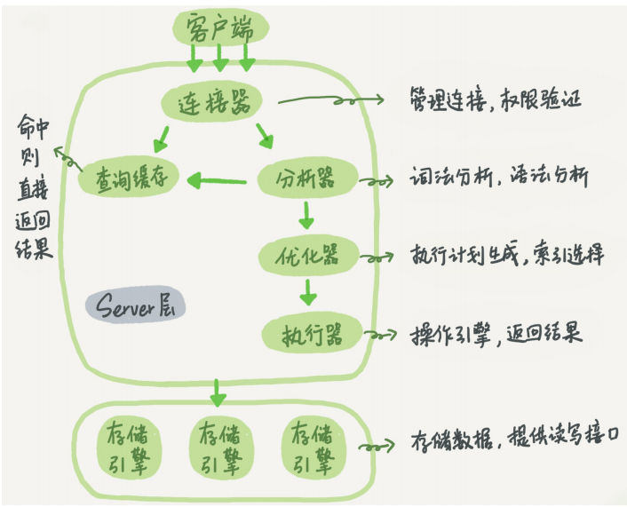

# MySQL实战笔记

## 1 基础架构

### 1.1 MySQL查询语句解析



MySQL 分为 Server 层和存储引擎部分。

**1. Server 层**

- 包括连接器、查询缓存、分析器、优化器和执行器等
- 所有内置函数（如日期、时间、数学和加密函数等）
- 所有跨存储引擎的功能实现（如存储过程、触发器、视图等）

**2. 存储引擎层**

1）作用

负责数据的存储和提取。

2）架构

存储引擎的架构模式是插件式的，支持InnoDB、MyISAM、Memory等多个存储引擎。

> InnoDB，从MySQL 5.5.5 后成为默认存储引擎。

#### 1.1.1 连接器

**1. 作用**

负责跟客户端：

- 建立连接
- 获取权限
- 维持和管理连接

> 生产环境中，禁止在 -p 后接密码来连接 MySQL。

**2. 流程**

①建立连接

- 判断用户名密码是否匹配，不匹配则返回“Access denied for user”错误。

②权限认证

- 用户名密码匹配，则到权限列表中查出当前用户的权限。

③维持和管理连接

> 管理员账号修改了某用户权限后，不会影响修改前已经连接的用户，只有新建立连接的用户权限会被修改。
>
> 客户端的连接超时时间参数是 wait_timeout ，默认值为8小时，客户端超时后再次请求会收到 “Lost connection to MySQL server during query”，此时需要重连再操作。

**3. 分类**

- 长连接：持续请求使用同一个连接
- 短连接：每次执行完很少的操作就断开连接，下次操作则重连

> 建立长连接的过程复杂，尽量减少建立连接的动作，即多使用长连接。

**4. 长连接**

1）异常重启问题

长连接过多时，MySQL 内存占用较高，因为 MySQL 在执行过程中临时使用的连接对象是管理在内存中的，这些资源在连接断开时才会释放，所以积累一段时间后，内存占用过大，被系统强杀（OOM），从而导致异常重启。

2）解决方案

- 定期断开长连接
- 执行过占用内存大的操作后断开长连接
- 每次执行一个较大开销的操作后，执行 mysql_reset_connection 来重新初始化连接资源（MySQL 5.7及以后版本）

#### 1.1.2 查询缓存

**1. 作用**

以 key-value 的形式缓存查询语句和查询结果，下一次相同的查询过来则直接返回查询结果。

**2. 问题**

只要执行对一张表的更新 ，这个表上所有的查询缓存都被会清空，所以**不建议使用查询缓存。**

> 很长时间才更新一次的静态表才适合使用查询缓存，如系统配置表。
>
> MySQL 8.0 后彻底放弃查询缓存功能。

**3. SQL**

1）不使用查询缓存

设置参数 query_cache_type 为 DEMAND。

2）按需使用查询缓存

````sql
-- 查询语句加上 SQL_CACHE 参数
select SQL_CACHE * from T
````

#### 1.1.3 分析器

**1. 作用**

- 词法分析
- 语法分析

**2. 流程**

①词法分析

识别 SQL 的关键字、表名、列名和字段值等。

②语法分析

语法分析器根据语法规则，判断语句是否满足 MySQL 语法。

> 一般语法错误会提示第一个出现错误的位置，所以关注点在紧接“use near”的内容。

#### 1.1.4 优化器

**作用**

- 表中有多个索引时，决定使用哪个索引
- 多表关联时，决定各个表的连接顺序
- 选择 SQL 语句执行效率最高的方案

#### 1.1.5 执行器

**1. 作用**

- 权限校验
- 引擎选择
- 返回查询结果

**2. 流程**

1）权限校验

执行时，校验用户是否有查询此表的权限，没有则返回无权限错误。

2）引擎选择

根据表的引擎定义，选择对应的存储引擎提供的接口。

3）查询并返回结果集

- 无索引的表

①调用 InnoDB 引擎接口，取表的第一行，判断是否满足条件，不满足则跳过；满足则将这行放入结果集中。

②调用引擎接口取下一行，重复同样的判断逻辑，直到取到表的最后一行。

③执行器将上述所有满足条件的行组成的记录作为结果集，返回给客户端。

- 有索引的表

①调用 InnoDB 引擎接口，取满足条件的第一行，不满足则跳过；满足则将这行放入结果集中。

②调用引擎接口取满足条件的下一行，重复同样的判断逻辑，直到取到表的最后一行。

③执行器将上述所有满足条件的行组成的记录作为结果集，返回给客户端。

### 1.2 MySQL 更新语句解析

- 前置步骤基本同查询语句，区别一个是查询，一个是更新
- 更新语句还涉及到 redo log（重做日志）和 binlog（归档日志）

#### 1.2.1 redo log

