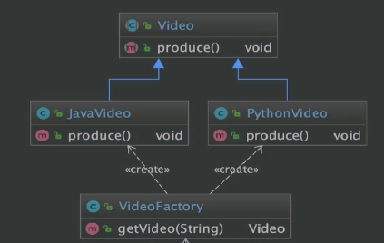

# 设计模式学习笔记

## 1 UML

### 1.1 基本概念

**1.定义**

统一建模语言（英语：Unified Modeling Language，缩写 *UML*）是非专利的第三代建模和规约语言。

**2.特点**

- UML是一种开放的方法。
- 用于说明、可视化、构建和编写一个正在开发的、面向对象的、软件密集系统的制品的开放方法。
- UML展现了一系列最佳工程实践，这些最佳实践在对大规模，复杂系统进行建模方面，特别是在软件架构层次已经被验证有效。

### 1.2 UML 2.2 分类

UML 2.2 中一共定义了14种图示，分三类：

- 结构式图形
- 行为式图形
- 交互式图形

**1. 结构式图形**

1）概念

强调的是系统式的建模

2）分类

- 静态图（类图，对象图，包图）
- 实现图（组件图，部署图）
- 剖面图
- 复合结构图

**2. 行为式图形**

1）概念

强调系统模型种触发的事件

2）分类

- 活动图
- 状态图
- 用例图

**3. 交互式图形**

1）概念

属于行为式图形子集合，强调系统模型中资料流程

2）分类

- 通信图
- 交互概述图（UML 2.2）
- 时序图（UML 2.2）
- 时间图（UML 2.2）

### 1.3 UML语法

**1. 符号**

- UML箭头方向：从子类指向父类。
- 实线表示继承
- 虚线表示实现
- 实线表示关联（如企鹅和气候的关系）
- 虚线表示依赖（如动物依赖水、氧气的关系）
- 空心菱形表示聚合（如大雁群和大雁的关系）
- 实心菱形表示组合（如鸟和翅膀的关系）
- 常见数字表达及含义

> 数字表达示例：假设有A类和B类，数字标记在A类侧。
>
> - 0..1表示0或1个实例
> - 0..*表示0或多个实例
> - 1..1表示1个实例
> - 1表示只有一个实例
> - 1..*表示至少有一个实例

**2. 时序图种**

时序图种包括的建模元素主要有：对象（Actor）、生命线（Lifeline）、控制焦点（Focus of control）、消息（Message）等。

**3. 类图分类**

- 斜体类名表示抽象类或方法
- `<<>>`表示接口
- `+`表示public
- `-`表示private
- `#`表示protected
- `~`表示default
- `_____`表示static属性或方法

## 2 设计原则

设计模式中有7大设计原则：

- 开闭原则
- 依赖倒置原则
- 单一职责原则
- 接口隔离原则
- 迪米特原则
- 里氏替换原则
- 合成复用原则

### 2.1 开闭原则

**1. 定义**

一个软件实体如类、模块和函数应该对扩展开放，对修改关闭。

**2. 约束条件**

用抽象构建框架，用实现扩展细节。

**3. 优点**

提高软件系统的可复用性及可维护性。

### 2.2 依赖倒置原则

**1. 定义**

高层模块不应该依赖底层模块，二者都应该依赖其抽象。

**2. 约束条件**

- 抽象不应该依赖细节，细节应该依赖抽象。

- 针对接口编程，不针对实现编程。

**3. 优点**

- 减少类间的耦合性。
- 提高系统稳定性。
- 提高代码可读性和维护性。
- 降低修改程序造成的风险。

### 2.3 单一职责原则

**1. 定义**

不要存在多于一个导致类变更的原因。

**2. 约束条件**

一个类/接口/方法只负责一项职责。

**3. 优点**

- 降低类的复杂度。
- 提高类的可读性。
- 提高系统的可维护性。
- 降低变更引起的风险。

### 2.4 接口隔离原则

**1. 定义**

用多个专门的接口，而不使用单一的总接口，客户端不应该依赖它不需要的接口。

**2. 约束条件**

- 一个类对一个类的依赖应该建立在最小的接口上。
- 建立单一接口，不要建立庞大臃肿的接口。
- 尽量细化接口，接口中的方法尽量少。

**3. 优点**

符合高内聚低耦合的设计思想，使得类具有很好的可读性、可扩展性和可维护性。

### 2.5 迪米特原则

**1. 定义**

一个对象应该对其他对象保持最少的了解。（又叫最少知道原则）

**2. 约束条件**

尽量降低类与类之间的耦合。

> 如 boss、leader 和 staff 之间，boss 只需要联系 leader，不和 staff 有直接联系，而让 leader 来联系 staff。

**3. 优点**

降低类之间的耦合。

### 2.6 里氏替换原则

**1. 定义**

基类可以出现的地方，子类一定可以出现。

### 2.7 合成复用原则

**1. 定义**

要求在对象的复用时，要尽量先使用组合或者聚合等关联关系来实现，其次才考虑使用继承关系来实现。

> 如果要使用继承关系，则必须严格遵循里氏替换原则。

## 3 二十三种设计模式

### 3.1 创建型模式

#### 工厂方法模式

**1. 定义**

定义一个创建对象的接口，但让实现整个接口的类来决定实例化哪个类，工厂方法让类的实例化推迟到子类中进行。

**2. 特性**

1）优点

- 用户只需关心所需产品对应的工厂，无需关心创建细节。

- 加入新产品符合开闭原则，提高可扩展性。

2）缺点

- 类的个数容易过多，增加复杂度。

- 增加了系统的抽象性和理解难度。

**3. 适用场景**

- 创建对象需要大量重复的代码。
- 客户端（应用层）不依赖于产品类实例如何被创建、实现等细节。
- 一个类通过其子类来制定创建哪个对象。

**4. 源码实例**

- JDK 源码中 java.util.Collection\<E> 接口（集合）的实现。
- JDK 源码中 java.net.URLStreamHandlerFactory 接口（URL 协议扩展）的实现。
- logback 源码中 ILoggerFactory 接口的实现。
- Spring 中的 BeanFactory、ApplicationContext 的实现。

**5. 示例代码**

1）UML 图

2）源码

（未完待续）

#### 抽象工厂模式

**1. 定义**

抽象工厂模式提供一个创建一系列相关或相互依赖对象的接口，无需指定它们具体的类。

**2. 特性**

1）优点

- 具体产品在应用层代码隔离，无需关心创建细节。
- 将一个系列的产品族统一到一起创建。

2）缺点

- 规定了所有可能被创建的产品集合，产品族中扩展新的产品困难，需要修改抽象工厂的接口。
- 增加了系统的抽象性和理解难度。

**3. 适用场景**

- 客户端（应用层）不依赖于产品类实例如何被创建、实现等细节。
- 强调一系列相关的产品对象（属于同一产品族）一起使用创建对象需要大量重复的代码。
- 提供一个产品类的库，所有的产品以同样的接口出现，从而使客户端不依赖于具体实现。

**4. 源码实例**

- JDK 源码中 java.sql.Connection 接口（数据库连接）的实现。
- JDK 源码中 java.sql.Statement 接口（返回静态 SQL 语句结果）的实现。
- Mybatis 源码中 SqlSessionFactory 接口（创建 SqlSession 对象操作数据库）的实现。

**5. 示例代码**

1）UML 图

2）源码

（未完待续）

#### 单例模式

#### 原型模式

**1. 定义**

。

**2. 特性**

1）优点

- 。

2）缺点

- 。

**3. 适用场景**

- 。

**4. 源码实例**

。

**5. 示例代码**

1）UML 图

2）源码

（未完待续）

#### 建造者模式

**1. 定义**

将一个复杂对象的构建与它的表示分离，使得同样的构建过程可以创建不同的表示。

> 用户只需指定建造的类型即可得到它们，而不需要了解其建造过程。

**2. 特性**

1）优点

- 封装性好，创建和使用分离。
- 扩展性好，建造类之间独立、一定程度上解耦。

2）缺点

- 产生多余的 Builder 对象。
- 若产品内部发生变化，建造者都要修改，成本较高。

**3. 适用场景**

- 适用于具有非常复杂的内部结构（很多属性）的一个对象。
- 把复杂对象的创建和使用分离的场景。

**4. 源码实例**

- JDK 源码中 java.lang.StringBuilder（final）类（单线程下操作可变 String 字符串）的实现。
- JDK 源码中 java.lang.StringBuilder（final）类（多线程下操作可变 String 字符串）的实现。
- Guava 源码中的 ImmutableSet 抽象类（不可变 Set 集合）的实现。
- Spring 中的 BeanDefinitionBuilder（final）类（构建 BeanDefinitions 对象）的实现。
- Mybatis 源码中 SqlSessionFactoryBuilder 类（构建 SqlSessionFactory 对象）的实现。

**5. 示例代码**

1）UML 图

2）源码

（未完待续）

### 3.2 结构型模式

#### 适配器模式

**1. 定义**

。

**2. 特性**

1）优点

- 。

2）缺点

- 。

**3. 适用场景**

- 。

**4. 源码实例**

。

**5. 示例代码**

1）UML 图

2）源码

（未完待续）

#### 桥接模式

**1. 定义**

。

**2. 特性**

1）优点

- 。

2）缺点

- 。

**3. 适用场景**

- 。

**4. 源码实例**

。

**5. 示例代码**

1）UML 图

2）源码

（未完待续）

#### 装饰者模式

**1. 定义**

。

**2. 特性**

1）优点

- 。

2）缺点

- 。

**3. 适用场景**

- 。

**4. 源码实例**

。

**5. 示例代码**

1）UML 图

2）源码

（未完待续）

#### 组合模式

**1. 定义**

。

**2. 特性**

1）优点

- 。

2）缺点

- 。

**3. 适用场景**

- 。

**4. 源码实例**

。

**5. 示例代码**

1）UML 图

2）源码

（未完待续）

#### 代理模式

**1. 定义**

。

**2. 特性**

1）优点

- 。

2）缺点

- 。

**3. 适用场景**

- 。

**4. 源码实例**

。

**5. 示例代码**

1）UML 图

2）源码

（未完待续）

#### 享元模式

**1. 定义**

。

**2. 特性**

1）优点

- 。

2）缺点

- 。

**3. 适用场景**

- 。

**4. 源码实例**

。

**5. 示例代码**

1）UML 图

2）源码

（未完待续）

#### 外观模式

**1. 定义**

。

**2. 特性**

1）优点

- 。

2）缺点

- 。

**3. 适用场景**

- 。

**4. 源码实例**

。

**5. 示例代码**

1）UML 图

2）源码

（未完待续）

### 3.3 行为型模式

#### 策略模式

**1. 定义**

。

**2. 特性**

1）优点

- 。

2）缺点

- 。

**3. 适用场景**

- 。

**4. 源码实例**

。

**5. 示例代码**

1）UML 图

2）源码

（未完待续）

#### 观察者模式

**1. 定义**

。

**2. 特性**

1）优点

- 。

2）缺点

- 。

**3. 适用场景**

- 。

**4. 源码实例**

。

**5. 示例代码**

1）UML 图

2）源码

（未完待续）

#### 责任链模式

**1. 定义**

。

**2. 特性**

1）优点

- 。

2）缺点

- 。

**3. 适用场景**

- 。

**4. 源码实例**

。

**5. 示例代码**

1）UML 图

2）源码

（未完待续）

#### 备忘录模式

**1. 定义**

。

**2. 特性**

1）优点

- 。

2）缺点

- 。

**3. 适用场景**

- 。

**4. 源码实例**

。

**5. 示例代码**

1）UML 图

2）源码

（未完待续）

#### 模板方法模式

**1. 定义**

。

**2. 特性**

1）优点

- 。

2）缺点

- 。

**3. 适用场景**

- 。

**4. 源码实例**

。

**5. 示例代码**

1）UML 图

2）源码

（未完待续）

#### 迭代器模式

**1. 定义**

。

**2. 特性**

1）优点

- 。

2）缺点

- 。

**3. 适用场景**

- 。

**4. 源码实例**

。

**5. 示例代码**

1）UML 图

2）源码

（未完待续）

#### 中介者模式

**1. 定义**

。

**2. 特性**

1）优点

- 。

2）缺点

- 。

**3. 适用场景**

- 。

**4. 源码实例**

。

**5. 示例代码**

1）UML 图

2）源码

（未完待续）

#### 命令模式

**1. 定义**

。

**2. 特性**

1）优点

- 。

2）缺点

- 。

**3. 适用场景**

- 。

**4. 源码实例**

。

**5. 示例代码**

1）UML 图

2）源码

（未完待续）

#### 访问者模式

**1. 定义**

。

**2. 特性**

1）优点

- 。

2）缺点

- 。

**3. 适用场景**

- 。

**4. 源码实例**

。

**5. 示例代码**

1）UML 图

2）源码

（未完待续）

#### 解释器模式

**1. 定义**

。

**2. 特性**

1）优点

- 。

2）缺点

- 。

**3. 适用场景**

- 。

**4. 源码实例**

。

**5. 示例代码**

1）UML 图

2）源码

（未完待续）

#### 状态模式

## 4 其他设计模式

### 4.1 创建型

#### 简单工厂模式

**1. 定义**

由一个工厂对象决定创建出哪一种产品的实例。

**2. 特性**

1）优点

- 只需传入一个正确的参数，即可获取所需的对象，而无需知道其创建细节。

2）缺点

- 工厂类的职责相对过重，增加新的产品，需要修改工厂类的判断逻辑，违背开闭原则。

**3. 适用场景**

- 工厂负责创建的对象较少。
- 客户端（应用层）只需知道传入工厂类的参数，而对于如何创建对象（逻辑）不关心。

**4. 源码实例**

- JDK 源码中 java.util.Calendar 抽象类（时间转换）的实现。
- logback 源码中 LoggerFactory （final）类的实现。

**5. 示例代码**

1）UML 图

2）源码

https://github.com/DragonV96/MyBasicDemo/tree/master/design-pattern/src/main/java/com/glw/design/pattern/creational/simple_factory

