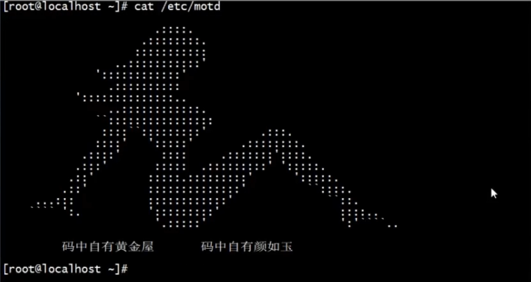

# Linux学习笔记(Cent OS7)

[1 常用命令](#1-常用命令)

- [1.1 创建](#11-创建)
- [1.2 删除](#12-删除)
- [1.3 查找](#13-查找)
- [1.4 安装centos必备库](#14-安装centos必备库)
- [1.5 查看系统信息](#15-查看系统信息)
- [1.6 进程](#16-进程)
- [1.7 添加环境变量](#17-添加环境变量)
- [1.8 添加插件命令](#18-添加插件命令)
- [1.9 防火墙配置](#19-防火墙配置)
- [1.10 权限](#110-权限)
- [1.11 添加快捷操作](#111-添加快捷操作)

[2 安装软件](#2-安装软件)

- [2.1 安装jdk](#21-安装jdk)
- [2.2 安装MAVEN](#22-安装MAVEN)
- [2.3 安装Tomcat](#23-安装Tomcat)
- [2.4 安装MySQL](#24-安装MySQL)
- [2.5 安装Git](#25-安装Git)
- [2.6 安装Redis](#26-安装Redis)
- [2.7 安装MongoDB](#27-安装MongoDB)
- [2.8 安装erlang](#28-安装erlang)
- [2.9 安装RabbitMQ](#29-安装RabbitMQ)
- [2.10 安装ActiveMQ](#210-安装ActiveMQ)
- [2.11 安装Docker](#211-安装Docker)
- [2.12 安装Jenkins](#212-安装Jenkins)
- [2.13 安装fastDFS](#213-安装fastDFS)

[3 卸载软件](#3-卸载软件)

- [3.1 卸载jdk](#31-卸载jdk)
- [3.2 卸载MySQL](#32-卸载MySQL)

[4 安装遇到问题](#4-安装遇到问题)

- [4.1 Jenkins问题](#41-Jenkins问题)
  - [4.1.1 Jenkins启动报错](#411-Jenkins启动报错)
  - [4.1.2登陆后页面空白](#412-登陆后页面空白)

[5 高级命令](#5-高级命令)

- [5.1 运行jar包](#51-运行jar包)
- [5.2 打开文件](#52-打开文件)
- [5.3 指定jmx文件执行Jmeter进行压测](#53-指定jmx文件执行Jmeter进行压测)

[附·骚操作](#附-骚操作)

## 1 常用命令
### 1.1 创建

​		**1.创建文件夹**

````
mkdir 文件夹名字
````
### 1.2 删除

**1.删除文件夹**

- -r 就是向下递归，不管有多少级目录，一并删除

- -f 就是直接强行删除，不作任何提示

````
rm -rf 目录名字
````

**2.删除文件**

````
rm -f 文件名字
````
### 1.3 查找

**1.查找文件**

````shell
find    可以找到你想要的文件
格式：  find [目录] [选项] [选项值]
目录：去哪找，可以不写，默认代表当前目录
选项：怎么找
    >> -name   按照名字找
        可以使用通配符
    -size   按照大小找
        单位为  kmg   10k（等于10k）   +10k（大于10k）   -10k（小于10k）
    -user   按照用户名
    -group  按照组名
    -maxdepth  -mindepth   限制查找的目录层级，默认递归查找所有
    -ctime  按照创建时间查找  单位是天
选项值：找什么
    find / -name demo.txt
    find / -name \*.txt
    find / -size +10k
    find / -user demo.txt
    find / -group demo.txt
    find / -mindepth 4 -name \*.txt
    find / -mindepth 3 -maxdepth 5 -name \*.txt
````

**2.查找文件内容**

````shell
grep   查找的内容   文件路径

实例：
grep movie demo.txt
grep movie ~/*.txt

选项
    --color=auto   将颜色高亮显示
        给 grep 指令起一个别名   vi ~/.bashrc
        添加一行     alias grep='grep --color=auto'
        让配置文件立即生效       source ~/.bashrc
    -c         得到内容的个数
    -i         不区分大小写的查找
    -n         显示在文档中的行号
    -r         递归查找，但是不能限制后缀，只能遍历所有
        grep -r that ~/*
    -l         只显示文件名，不显示内容

实例：（显示当前目录下所有txt文件中含有xxx字段的文件）
grep -l xxx ~/test/*.txt

正则表达式进行查找
    \w(数字字母下划线)   
    \W(除了上面)
    \d(数字)
    \D(非数字)
    .(除了换行符)
    *(任意多个)
    +(至少1个)
    ?(0个或者1个)
    te-st@163.com   abc_def@qq.com   lala@sina.cn   benben@meme.net
    
实例：（-E   使用正则表达式来进行匹配）
grep -E .*? demo.txt 

grep --color=auto [要查找的关键字] [要查找的文件]

实例：
grep --color=auto 56684444sva server.log
grep --color=auto 56684444sva *.log
````
### 1.4 安装centos必备库

**1.使用yum安装gcc**

````
yum -y install gcc gcc-c++ kernel-devel 		安装gcc、c++编译器以及内核文件
````

**2.使用yum安装vim**

````
sudo yum install -y vim
````

**3.清除yum缓存**

```
yum clean all
```
### 1.5 查看系统信息

**1.查看本机网络信息（IP地址、网关、DNS等）**

````
ifconfig
````

**2.查看当前系统ip**

```
ip addr
```

**3.查看当前目录完整路径**

````
pwd
````
### 1.6 进程

**1.检查占用8080端口的进程。**

````
netstat -lnp|grep 8080
````

**2.查看PID编号为12345进程的详细信息。**

````
ps 12345
````

**3.关闭PID编号为12345的进程**

````
kill -9 12345
````

**4.清除过大的buff/cache（缓存）**

```
echo 3 > /proc/sys/vm/drop_caches
```
### 1.7 添加环境变量

**1.编辑系统环境文件**

````
vim /etc/profile
````
### 1.8 添加插件命令

**1.安装wget命令**

````
yum -y install wget
````
### 1.9 防火墙配置

**1.查看防火墙状态**（running表示正在运行，not running表示已停止）

````
firewall-cmd --state
systemctl status firewalld
````

**2.开启/关闭/重启防火墙**

```
systemctl stop firewalld		（关闭）
systemctl start firewalld		（开启）
firewall-cmd --reload			（重启）
service firewalld restart		（重启）
```

**3.开启/关闭防火墙的开机自启**（进行关闭操作前需要提前关闭防火墙）

```
systemctl disable firewalld		（关闭）
systemctl enable firewalld		（开启）
```

**4.查看防火墙已开放端口列表**

```
firewall-cmd --permanent --list-port
```

**5.开放/关闭指定端口，使其生效需要重启防火墙**（如3306，临时开放只需去掉`--perament`，重启虚拟机则自动失效）

````
firewall-cmd --zone=public --add-port=3306/tcp --permanent		(开放)
firewall-cmd --zone=public --remove-port=3306/tcp --permanent	(关闭)

常用端口开放命令：
firewall-cmd --zone=public --add-port=3306-8080/tcp --permanent
firewall-cmd --zone=public --add-port=80/http --permanent
firewall-cmd --zone=public --add-port=443/https --permanent
````

**6.批量开放指定端口，使其生效需要重启防火墙**（如3306和8080，临时开放只需去掉`--perament`，重启虚拟机则自动失效）

```
firewall-cmd --zone=public --add-port=3306-8080/tcp --permanent
```
### 1.10 权限

**1. 给shell脚本可执行权限**

````
chmod +x [脚本文件名].sh

实例：
chmod +x deploy-network.sh
````

**2. 执行shell脚本命令**

````
./[脚本文件名].sh

实例：
./deploy-network.sh
````
### 1.11 添加快捷操作

**1. 添加快捷操作**（如任意位置启动nginx）

````
第一步：执行命令编辑.bashrc文件
vim ~/.bashrc
或
vi ~/.bashrc

第二步：按a进入编辑状态，新起一行输入（路径根据自己实际情况设定）：
alias nginx="bash /usr/local/nginx/sbin/nginx"

第三步：按下ESC，然后输入:wq保存更改并退出
第四步：执行命令使更改生效
source ~/.bashrc
````
## 2 安装软件

默认前置步骤都是已经将相应的linux压缩包通过xftp上传至linux系统目录下。
### 2.1 安装jdk

**若系统自带jdk，[点这里跳到第三章第一节进行卸载后再安装。**

进行步骤1之前，可选择移动到统一自定义文件夹(/usr/local/java)下。

```
mkdir /usr/local/java			（创建文件夹）
mv jdk-8u211-linux-x64.tar.gz /usr/local/java/		（解压到java文件夹下）
```

1.进入java文件夹

````
cd /usr/local/java
````

2.解压jdk安装包

````
tar -zxvf jdk-8u211-linux-x64.tar.gz
````

3.进入系统文件（/etc/profile），添加环境变量，并重新加载此文件

```
vim /etc/profile

按a进入编辑模式，在底部添加这三行代码：
export JAVA_HOME=/usr/local/java/jdk1.8.0_211
export PATH=$PATH:$JAVA_HOME/bin
export CLASSPATH=.:$JAVA_HOME/jre/lib/rt.jar:$JAVA_HOME/lib/dt.jar:$JAVA_HOME/lib/tools.jar

先按ESC退出编辑：
:wq			（保存更改并退出）
source /etc/profile		（使profile文件修改生效）
```

4.查看jdk版本

````
java -version
````
### 2.2 安装MAVEN

**请装好JDK后再执行下述步骤**

1.在/usr/local目录下创建maven文件夹（为了运维规范化，建议建立在/usr/local下）

````
mkdir /usr/local/maven
cd /usr/local/maven
````

2.获取华中科技大学镜像官网的maven镜像（若无法执行wget命令请参考第一章1.8）

````
wget http://mirrors.hust.edu.cn/apache/maven/maven-3/3.6.0/binaries/apache-maven-3.6.0-bin.tar.gz
````

3.解压tar包到当前文件夹（maven）下

````
tar -zxvf apache-maven-3.6.0-bin.tar.gz
````

4.进入系统文件（/etc/pcrofile），添加环境变量，并重新加载此文件

```
vim /etc/profile

按a进入编辑模式，在底部添加这两行代码：
export MAVEN_HOME=/usr/local/maven/apache-maven-3.6.0
export PATH=$PATH:$MAVEN_HOME/bin

先按ESC退出编辑：
:wq			（保存更改并退出）
source /etc/profile		（使profile文件修改生效）
```

5.配置maven仓库路径

````
mkdir /home/local_repository				(创建仓库位置，可自定义maven仓库路径)
cd /usr/local/maven/apache-maven-3.6.0/conf		(进入conf文件夹)

vim settings.xml							(编辑maven配置文件)
按a进入编辑模式，添加仓库路径代码：（按/进入搜索状态，搜索localRepository）
<localRepository>/home/local_repository</localRepository>

````

6.运行命令将常用的包从maven中央仓库下载文件到本地：

````
mvn -help:system
````

7.查看maven版本

````
mvn -version
````
### 2.3 安装Tomcat

**请装好JDK后再执行下述步骤**

1.在/usr/local目录下创建tomcat文件夹（为了运维规范化，建议建立在/usr/local下）

```
mkdir /usr/local/tomcat
cd /usr/local/tomcat
```

2.获取华中科技大学镜像官网的tomcat镜像（若无法执行wget命令请参考第一章1.8）

````
wget http://mirrors.hust.edu.cn/apache/tomcat/tomcat-8/v8.5.38/bin/apache-tomcat-8.5.38.tar.gz
````

3.解压tar包到当前文件夹（tomcat）下

```
tar -zxvf apache-tomcat-8.5.38.tar.gz
```

4.为了在任意地方通过`service tomcat start `就可以启动tomcat，将tomcat中的`/bin/catalina.sh `脚本 拷贝到`init.d`下

````
cp -p /usr/local/tomcat/apache-tomcat-8.5.38/bin/catalina.sh /etc/init.d/tomcat
````

5.编辑/etc/init.d/tomcat文件

````
vim /etc/init.d/tomcat

按a进入编辑模式，在第二行加入下面7行代码：
## chkconfig: 112 63 37
## description: tomcat server init script
## Source Function Library
./etc/init.d/functions

JAVA_HOME=/usr/local/java/jdk1.8.0_211
CATALINA_HOME=/usr/local/tomcat/apache-tomcat-8.5.38
````

6.赋予tomcat权限，将tomcat加入到系统服务并检查是否生效，依次执行下述命令

````
chmod 755 /etc/init.d/tomcat
chkconfig --add tomcat
chkconfig tomcat on
````

7.启动tomcat

````
service tomcat start
````

8.浏览器输入`http://虚拟机IP地址:8080`能看到主界面则启动成功（步骤正确但是不能访问界面，参考第一章1.9 关闭防火墙或者开放8080端口）

9.关闭tomcat

````
service tomcat stop
````
### 2.4 安装MySQL

1.在/usr/local目录下创建mysql文件夹（为了运维规范化，建议建立在/usr/local下）

```
mkdir /usr/local/mysql
cd /usr/local/mysql
```

2.获取华中科技大学镜像官网的tomcat镜像（若无法执行wget命令请参考第一章1.8）

```
wget https://cdn.mysql.com//Downloads/MySQL-5.7/mysql-5.7.26-linux-glibc2.12-x86_64.tar.gz
```

3.解压tar包到当前文件夹（mysql）下

```
tar -zxvf mysql-5.7.26-linux-glibc2.12-x86_64.tar.gz
```

未完
### 2.5 安装Git

1.查看是否安装过git

````
rpm -qa|grep git
````

显示有以`git-`+版本号的字符，表示已经装过git

2.若已经安装，需要先卸载（两条命令任选其一即可）

````
rpm -e --nodeps git
rpm -e git
````

3.未完
### 2.6 安装Redis
### 2.7 安装MongoDB
### 2.8 安装erlang

1.安装前置依赖

````
yum install ncurses-devel
````

2.解压

````
tar -zxvf otp_src_20.1.tar.gz
````

3.进入解压后的erlang目录，然后执行下面命令（不安装javac）

````
./configure --prefix=/usr/local/erlang20 --without-javac
````
4.在当前目录直接执行编译，然后再执行下面的安装命令

````
make				（编译）
make install		（安装）
===============================================
make -j 4	(四核cpu编译可采取这个方法，效率更高)
````

5.运行erlang，执行erlang安装路径中bin路径下的erl文件即可

````
./bin/erl
````

6.进入系统文件（/etc/profile），添加环境变量，并重新加载此文件

````
vim /etc/profile
按a进入编辑模式，在底部添加这句话：
export PATH=$PATH:/usr/local/erlang20/bin
先按ESC退出编辑：
:wq			（保存更改并退出）
source /etc/profile		（使profile文件修改生效）
````
### 2.9 安装RabbitMQ

**请装好erlang后再执行下述步骤**

1.安装python：

````
yum install python -y
````

2.安装simplejson（-y是后续询问步骤直接yes）

````
yum install xmlto -y
yum install python-simplejson -y
````

进行步骤3之前，要求移动到统一自定义文件夹`/usr/local/rabbitmq`下

```
mv rabbitmq_server-3.6.14 /usr/local/rabbitmq
```

3.先解压xz，再解压tar

````
xz -d rabbitmq-server-generic-unix-3.6.14.tar.xz
tar xf rabbitmq-server-generic-unix-3.6.14.tar
````

4.进入rabbitmq路径下sbin目录启动rabbitMQ server

````
./rabbitmq-server
./rabbitmq-server stop		(关闭rabbitMQ服务)
````

5.查看rabbitMQ server服务（默认5672端口）

````
netstat -nap|grep 5672
````

6.进入系统文件，添加环境变量，并重新加载此文件

```
vim /etc/profile
按a进入编辑模式，在底部添加行代码：
export PATH=$PATH:/usr/local/rabbitmq/sbin

先按ESC退出编辑：
:wq			（保存更改并退出）
source /etc/profile		（使profile文件修改生效）
```
### 2.10 安装ActiveMQ

1.在/usr/local目录下创建activemq文件夹（为了运维规范化，建议建立在/usr/local下）

```
mkdir /usr/local/activemq
cd /usr/local/activemq
```

2.将下载好的ActiveMQ通过xftp（或其他ftp工具）传到linux上的`/usr/local/activemq/`文件夹下, [下载地址](http://activemq.apache.org/activemq-5155-release.html)

3.解压tar包到当前文件夹（activemq）下

```
tar -zxvf apache-activemq-5.15.5-bin.tar.gz
```

4.启动/停止/查看ActiveMQ服务，首先需要进入`apache-activemq-5.15.5`目录（当前操作可跳过）

```
cd /usr/local/activemq/apache-activemq-5.15.5	（进入目录）

bin/activemq start				(启动activemq服务)
bin/activemq status				(查看activemq服务状态)
bin/activemq stop				(停止activemq服务)
```

5.为了在任意地方通过`service activemq start `就可以启动activemq，配置`JAVA_HOME`地址，然后建立软连接

```
vim /usr/local/activemq/apache-activemq-5.15.5/bin/activemq
按a进入编辑模式，在第一行添加这句话：
export JAVA_HOME="/usr/local/java/jdk1.8.0_211"
先按ESC退出编辑：
:wq			（保存更改并退出）

ln -s /usr/local/activemq/apache-activemq-5.15.5/bin/activemq /etc/init.d	(建立软连接)
```

6.配置开机启动，可通过系统指令在任意位置进行启动/停止/查看activemq服务

````
chkconfig activemq on				(设置开机启动)

service activemq start				(启动activemq服务)
service activemq status				(查看activemq服务状态)
service activemq stop				(停止activemq服务)
````

7.配置防火墙开放ActiveMQ端口

````
firewall-cmd --zone=public --add-port=8161/tcp --permanent		(开放8161端口)
firewall-cmd --reload											(重启防火墙)
````

8.打开浏览器访问`http://虚拟机IP地址:8161`，账号密码均为`admin`
### 2.11 安装Docker

Docker 要求 CentOS 系统的内核版本高于 3.10 。

1.查看操作系统当前的内核版本

````
uname -r
````

2.更新yum包到最新

````
yum update
````

3.卸载旧版本（如果存在旧版本，不存在则跳过）

````
yum remove docker docker-common docker-selinux docker-engine -y
````

4.安装docker需要的软件，yum-util提供yum-config-manager功能，其他两个是devicemapper驱动依赖的包

````
yum install -y yum-utils device-mapper-persistent-data lvm2
````

5.配置yum源

````
yum-config-manager --add-repo http://mirrors.aliyun.com/docker-ce/linux/centos/docker-ce.repo
````

6.查看所有仓库中所有docker版本，并选择特定版本进行安装

````
yum list docker-ce --showduplicates | sort -r
````

7.安装docker

````
yum -y install docker-ce			(默认装最新稳定版)
````

8.启动docker服务

````
systemctl start docker		(启动)
systemctl stop docker		(关闭,安装过程不要执行)
````

9.开机启动docker服务

````
systemctl enable docker		(启动)
systemctl disable docker	(关闭,安装过程不要执行)
````

10.查看docker版本（有client和server表示docker安装成功）

````
docker version
````
### 2.12 安装Jenkins

1.下载Jenkins库

```
wget -O /etc/yum.repos.d/jenkins.repo https://pkg.jenkins.io/redhat-stable/jenkins.repo
```

2.导入key

````
rpm --import https://pkg.jenkins.io/redhat-stable/jenkins.io.key
````

3.安装Jenkins

```
yum install -y jenkins
```

4.启动/停止/查看Jenkins服务（执行启动即可）

```
systemctl start jenkins				(启动activemq服务)
systemctl status jenkins				(查看activemq服务状态)
systemctl stop jenkins				(停止activemq服务)
```

5.因为Jenkins默认端口是8080，可能会导致端口冲突，修改Jenkins的默认端口即可

```
vim /etc/sysconfig/jenkins

直接输入（搜索关键字）：
/JENKINS_PORT

按a进入编辑模式，将JENKINS_PORT后的端口改为需要的：
JENKINS_PORT=8888

先按ESC退出编辑：
:wq			（保存更改并退出）
```

6.配置防火墙开放Jenkins端口

```
firewall-cmd --zone=public --add-port=8888/tcp --permanent		(开放8888端口)
firewall-cmd --reload											(重启防火墙)
```

7.打开浏览器访问`http://虚拟机IP地址:8888`(192.168.241.129:8888)

8.在服务器上查看当前的初始化密码

````
cat /var/lib/jenkins/secrets/initialAdminPassword
````
### 2.13 安装fastDFS
## 3 卸载软件
### 3.1 卸载jdk

1.查询系统是否安装jdk（三种命令执行一种即可）

````
rpm -qa|grep java
rpm -qa|grep jdk
rpm -qa|grep gcj 
````

2.卸载已安装的jdk（带有openjdk名字的）

````
rpm -e --nodeps java-1.8.0-openjdk-1.8.0.181-7.b13.el7.x86_64
rpm -e --nodeps java-1.8.0-openjdk-headless-1.8.0.181-7.b13.el7.x86_64
````

3.验证一下是否还有jdk（两种命令执行一种即可）

````
rpm -qa|grep java
java -version
````
### 3.2 卸载MySQL
## 4 安装遇到问题
### 4.1 Jenkins问题

#### 4.1.1 Jenkins启动报错

输入`systemctl start jenkins`出现下面错误提示：


1.运行命令查看错误详细信息

````
systemctl status jenkins
````

显示错误提示如下：


图中第一个标注是Jenkins加载的路径,第二个标注是Jenkins的错误详细信息：`Failed to start LSB: Jenkins Automation Server`

这是因为Jenkins 未加载到 java 环境的问题,直接修改 Jenkins 的启动文件,并在 candidates 参数内追加 java 的环境变量即可

2.编辑jenkins文件，追加 java 的环境变量

````
vim /etc/rc.d/init.d/jenkins

直接输入并回车（搜索关键字）：
/candidates

按a进入编辑模式，将candiddates中的/usr/bin/java下面添加当前系统的java环境变量：
/usr/local/java/jdk1.8.0_211/bin/java

先按ESC退出编辑：
:wq			（保存更改并退出）
````

3.重新启动Jenkins服务

````
systemctl restart jenkins
````

4.查看Jenkins服务，服务运行成功

````
systemctl status jenkins
````

#### 4.1.2 登陆后页面空白

1.访问jenkins地址（IP输入虚拟机地址，端口参照自己设置的）

````
http://虚拟机IP地址:8080/pluginManager/advanced
````

2.登陆之后将页面下拉到底部将升级站点的https改为http之后提交


3.重启jenkins，可直接在浏览器输入`http://虚拟机IP地址:8080/restart`（也可在终端通过命令执行）
## 5 高级命令

### 5.1 运行jar包

````
nohup java -jar miaosha.jar &
````

nohup表示把jar包输出日志存放到当前文件夹下新生成的nohup.out中。

### 5.2 打开文件

````
tail -f nohut.out
````

打开nohut.out文件

### 5.3 指定jmx文件执行Jmeter进行压测

````
./jarCollection/apache-jmeter-5.1.1/bin/jmeter.sh -n -t to_list.jmx -l result.jtl
````

将jmeter压测完的数据保存在result.jtl文件中。(`-n`：以NoGUI方式运行脚本;  `-t`：后面接脚本名称;`-l`：后面接日志名称，保存运行结果)
## 附·骚操作



​		打开linux想要显示一个招牌图案可以复制相应的文字图案，然后执行下面命令

​		`cat /etc/motd`

​		将复制好的文字图案粘贴进这个文件即可。