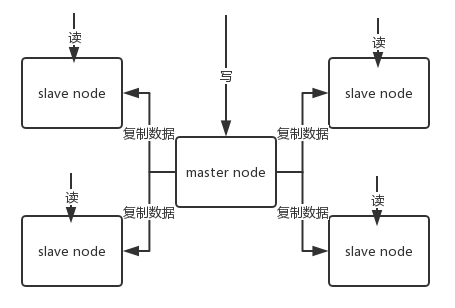
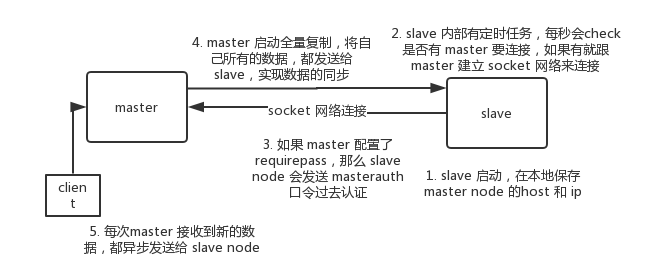

- [1 缓存](#1-缓存)
  - [1.1 缓存作用](#11-缓存作用)
  - [1.2 缓存带来的问题](#12-缓存带来的问题)
- [2 Redis基础](#2-Redis基础)
  - [2.1 Redis与Memcached区别](#21-Redis与Memcached区别)
  - [2.2 Redis数据结构](#22-Redis数据结构)
  - [2.3 Redis线程模型](#23-Redis线程模型)
- [3 Redis内存机制](#3-Redis内存机制)
  - [3.1 Redis过期策略](#31-Redis过期策略)
  - [3.2 Redis内部淘汰机制](#32-Redis内部淘汰机制)
  - [3.3 LRU算法](#33-LRU算法)
- [4 Redis持久化](#4-Redis持久化)
  - [4.1 RDB](#41-RDB)
  - [4.2 AOF](#42-AOF)
  - [4.3 RDB与AOF对比](#43-RDB与AOF对比)
- [5 Redis主从架构](#5-Redis主从架构)
  - [5.1 redis replication的核心机制](#51-redis replication的核心机制)
  - [5.2 主从复制的核心原理](#52-主从复制的核心原理)
    - [5.2.1 复制流程概述](#521-复制流程概述)
    - [5.2.2 主从复制的断点续传](#522-主从复制的断点续传)
    - [5.2.3 无磁盘化复制](#523-无磁盘化复制)
    - [5.2.4 过期key处理](#524-过期key处理)
  - [5.3 复制的完整流程](#53-复制的完整流程)
    - [5.3.1 全量复制](#531-全量复制)
    - [5.3.2 增量复制](#532-增量复制)
    - [5.3.3 心跳](#533-心跳)
    - [5.3.4 异步复制](#534-异步复制)
  - [5.4 Redis如何做到高可用](#54-Redis如何做到高可用)
- [6 Redis哨兵机制](#6-Redis哨兵机制)
- [7 常见的Redis场景](#7-常见的Redis场景)

# Redis总结

## 1 缓存

缓存指数据交换的缓冲区。

### 1.1 缓存作用

- **高性能**：预加载复杂、耗时且极少修改的查询，用户体验丝滑流畅
- **高并发**：内存中key-value式操作，单机支撑并发量达到几万十几万，是mysql的几十倍（因为缓存走内存，mysql走磁盘I/O）

### 1.2 缓存带来的问题

- 缓存与数据库双写不一致
- 缓存雪崩、缓存穿透、缓存击穿
- 缓存并发竞争

## 2 Redis基础

### 2.1 Redis与Memcached区别

| 区别     | Redis                                                        | Memcached              |
| -------- | ------------------------------------------------------------ | ---------------------- |
| 数据结构 | 支持string、hash、list、set、sorted set、bitmap、hyperloglog和geospatial等8种数据结构(5.0引入了stream) | 只支持String和整数     |
| 线程模型 | 单线程处理                                                   | 多线程处理             |
| 性能对比 | 100k以上数据性能较低，100k以下性能较高                       | 与其相反               |
| 部署模式 | 原生支持集群模式                                             | 原生仅支持单机部署模式 |
| 同步方式 | 支持主从同步                                                 | 不支持复制             |

### 2.2 Redis数据结构

**1. 基础数据结构**

- String
- hash
- list
- set
- sorted set

1）String

最简单的KV存储（效率比Memcached高）。

> value也可以存数字，如：数字类型（数字类型可用Long表示时）。

````
set name JeasonBourne
````

2）hash

类似map的数据结构。

> 可存储结构化数据的同时只修改其中的部分属性，如：一个对象（对象中不能嵌套对象）。

````
hset person name JeasonBourne
hset person age 25
hset person sex man
hget person age
````

````
person = {
	"name": "JeasonBourne",
	"age": 25,
	"sex": "man"
}
````

3）list

有序列表。

> 可利用list存储列表型的数据结构，实现如存储粉丝列表、文章评论列表等。

> 可通过lrange命令实现高性能分页，如微博下拉刷新的分页操作。

````shell
# 0表示开始位置，-1表示结束位置，结束位置为-1时，表示列表的最后一个位置，即查看所有
lrange pageList 0 -1
````

> 可利用list存储的顺序结构，实现如简易版消息队列

````
lpush mqDemo 1
lpush mqDemo 2

rpop mqDemo
````

4）set

无序集合，自动去重。

> 可利用set的交集、并集和差集操作，实现如两个好友间的共同好友、可能认识的人等。

````shell
# 操作单个set
# 添加元素
sadd hisSet 1

# 查看全部元素
smembers hisSet

# 判断是否包含某个元素
sismember hisSet 1

# 删除某个/多个元素
srem hisSet 1
srem hisSet 2 4

# 查看元素个数
scard hisSet

# 随机删除一个元素
spop hisSet
````

````shell
# 操作多个set
# 将一个set的元素移动到另外一个set
smove yourSet hisSet 2

# 求两set的交集
sinter yourSet hisSet

# 求两set的并集
sunion yourSet hisSet

# 求在yourSet中而不在mySet中的元素
sdiff yourSet hisSet
````

5）sorted set

排序且去重的set（写入操作时给一个分数，自动根据分数排序，分数可重复，值会被去重）。

> 可利用sorted set的排序去重特性，实现如排行榜、成绩排名等功能。

````
zadd actors 85 JeasonBourne
zadd actors 72 MichaelScofield
zadd actors 96 TBAG
zadd actors 63 LincolnBurrows

# 获取排名前三的用户（默认是升序，所以需要 rev 改为降序）
zrevrange actors 0 3

# 获取某用户的排名
zrank actors TBAG
````

**2. 高级数据结构**

- bitmap
- hyperloglog
- GEO
- stream（Redis5.0+）

### 2.3 Redis线程模型

Redis的内部文件事件处理器 `file event handler` 是**单线程**的，所以Redis是单线程模型。

**1. 原理**

Redis的内部文件事件处理器采用 I/O 多路服用机制，同时监听多个 socket ，将产生时间的 socket 压入内存队列中，时间分派器根据 socket 上的事件类型来选择对应的事件处理器进行处理。

**2. 文件事件处理器组成**

- 多个socket
- I/O 多路复用程序
- 文件事件分派器
- 事件处理器（连接应答处理器、命令请求处理器、命令恢复处理器）

**3. Redis与客户端的通信过程**


①Redis 服务端进程初始化的时候，会将 server socket 的 `AE_READABLE` 事件与连接应答处理器关联。

②客户端 socket01 向 redis 进程的 server socket 请求建立连接，此时 server socket 会产生一个 `AE_READABLE` 事件，IO 多路复用程序监听到 server socket 产生的事件后，将该 socket 压入队列中。文件事件分派器从队列中获取 socket，交给**连接应答处理器**。连接应答处理器会创建一个能与客户端通信的 socket01，并将该 socket01 的 `AE_READABLE` 事件与命令请求处理器关联。

③假设此时客户端发送了一个 `set key value` 请求，此时 redis 中的 socket01 会产生 `AE_READABLE` 事件，IO 多路复用程序将 socket01 压入队列，此时事件分派器从队列中获取到 socket01 产生的 `AE_READABLE` 事件，由于前面 socket01 的 `AE_READABLE` 事件已经与命令请求处理器关联，因此事件分派器将事件交给命令请求处理器来处理。命令请求处理器读取 socket01 的 `key value` 并在自己内存中完成 `key value` 的设置。操作完成后，它会将 socket01 的 `AE_WRITABLE` 事件与命令回复处理器关联。

④如果此时客户端准备好接收返回结果了，那么 redis 中的 socket01 会产生一个 `AE_WRITABLE` 事件，同样压入队列中，事件分派器找到相关联的命令回复处理器，由命令回复处理器对 socket01 输入本次操作的一个结果，比如 `ok`，之后解除 socket01 的 `AE_WRITABLE` 事件与命令回复处理器的关联。

这就是Redis与客户端的一次通信过程。

**4. Redis单线程模型效率高的原因**

- 纯内存操作
- 核心是基于非阻塞的 I/O 多路服用机制
- C语言实现，执行速度快
- 单线程避免了多线程的频繁上下文切换的问题和多线程之间的竞争问题

## 3 Redis内存机制

### 3.1 Redis过期策略

- 定期删除
- 惰性删除

> Redis 同时使用 定期删除和惰性删除 两种方式的过期策略。

**1. 定期删除**

Redis 默认每隔 100ms 会随机抽取一些设置过期时间的 key，检查其是否过期，过期则删除。

**2. 惰性删除**

Redis在获取key的时候会事先判断这个 key 是否过期，过期则删除，且没有任何返回。

### 3.2 Redis内部淘汰机制

6种淘汰机制：

> 前提：当机器内存不足以容纳新写入的数据时。

- noeviction：写入报错
- **allkeys-lru**：所有key中，移除最近最少使用的key**（最常用）**
- allkeys-random：所有key中，随机移除某个key
- volatile-lru：设置过期时间的key中，移除最近最少使用的key
- volatile-random：设置过期时间的key中，随机移除某个key
- volatile-ttl：设置过期时间的key中，优先移除更早过期的key

### 3.3 LRU算法

利用 JDK 已有的数据结构实现一个 Java 版的 LRU。

> LRU算法指最近最少使用，是一种常用的页面置换算法。

````java
public class LRUCache<K, V> extends LinkedHashMap<K, V> {
	private final int MAX_SIZE;
    
    /**
     * 传递进来最多能缓存的数据大小
     * @param maxSize 缓存大小
     */
    public LRUCache(int maxSize) {
        super((int) Math.ceil(size / 0.75) + 1, 0.75f, true);
        MAX_SIZE = maxSize;
    }

    @Override
    protected boolean removeEldestEntry(Map.Entry<K, V> eldest) {
        // 当 map中的数据量大于指定的缓存个数的时候，就自动删除最老的数据。
        return size() > MAX_SIZE;
    }
}
````

## 4 Redis持久化

Redis若只是将数据放在内存中，一旦宕机重启，数据就全没了。所以Redis提供了持久化机制，在数据写入内存的同时，异步的慢慢将数据写入磁盘文件中，进行持久化。

>  Redis宕机重启后可以重新加载宕机前的持久化数据，迅速恢复可用状态，但是会丢失少许数据。

Redis持久化机制有两种：

- RDB
- AOF

> 同时使用 RDB 和 AOF 两种持久化机制，那么Redis重启时，会使用 AOF 来重新构建数据，因为 AOF 中的数据更完整。

### 4.1 RDB

**1. 概念**

RDB 机制是对Redis中的数据进行**周期性**的持久化。

**2. 特性**

- 优点：
  - 生成多个数据文件，每个文件都是某时刻的数据快照，非常适合冷备
  - 有利于保持redis的高性能，因为 Redis 额外fork子进程进行磁盘I/O持久化，对redis对外提供读写服务的影响较小
  - Redis重启时恢复速度更快
- 缺点：
  - 故障时丢失数据较多，因为一般每隔5分钟或更长时间生成一次数据快照
  - 数据文件过大则会导致 redis 服务暂停数毫秒，或者甚至数秒，因为fork子进程执行持久化快照数据时会占用大量服务器资源

### 4.2 AOF

**1. 概念**

AOF 机制是对每条写入命令作为日志，以 `append-only` 的模式写入一个日志文件中。

> 在Redis重启时，可以通过回放 AOF 日志中的写入命令来重新构建整个数据集。

**2. 特性**

- 优点：

  - 故障时数据丢失少，因为一般每隔1秒后台线程执行一次fsync操作，最多丢失1秒的数据
  - 写入性能高，文件不易损坏且易修复，因为以append-only模式写入，无任何磁盘寻址开销
  - 日志文件过大时不影响redis读写性能，因为在rewrite log时，会压缩指令，创建出一份需要恢复数据的最小日志。在创建新日志文件的时候，老的日志文件照常写入。当新的 merge 后的日志文件 ready 的时候，再交换新老日志文件
  - 日志文件的命令具有可读性，非常**适合做灾难性的误删除的紧急恢复**，如某人不小心用 `flushall` 命令清空了所有数据，只要这个时候后台 `rewrite` 还没有发生，那么就可以立即拷贝 AOF 文件，将最后一条 `flushall` 命令给删了，然后再将该 `AOF` 文件放回去，就可以通过恢复机制，自动恢复所有数据

- 缺点：

  - 日志文件磁盘占用空间大

  - 开启AOF后会降低redis写数据的QPS，因为 AOF 一般会配置成每秒 `fsync` 一次日志文件，当然，每秒一次 `fsync`，性能也还是很高的（如果实时写入，那么 QPS 会大降，redis 性能会大大降低）

  - rewrite过程较为复杂，恢复数据可能出现bug

    > 以前 AOF 发生过 bug，就是通过 AOF 记录的日志，进行数据恢复的时候，没有恢复一模一样的数据出来。所以说，类似 AOF 这种较为复杂的基于命令日志 `merge` 回放的方式，比基于 RDB 每次持久化一份完整的数据快照文件的方式，更加脆弱一些，容易有 bug。不过 AOF 就是为了避免 rewrite 过程导致的 bug，因此每次 rewrite 并不是基于旧的指令日志进行 merge 的，而是**基于当时内存中的数据进行指令的重新构建**，这样健壮性会好很多。

### 4.3 RDB与AOF对比

|    区别     |             RDB              |              AOF               |
| :---------: | :--------------------------: | :----------------------------: |
|  文件备份   |         多个数据文件         |            单个文件            |
|  备份方式   | 周期性持久化，即内存数据快照 | 以日志形式记录每一次的操作命令 |
|  文件大小   |          占用空间小          |           占用空间大           |
| 对Redis影响 |            非常小            |     会降低Redis写数据的QPS     |
|  恢复速度   |              快              |               慢               |
| 恢复完整性  |     丢失数据较多（5min）     |       丢失数据极少（1s）       |
|  适用场景   |             冷备             |            紧急容灾            |

## 5 Redis主从架构

**概念**

主从架构(master-slave)，一主多从，主负责写，并且将数据复制到其它的 slave 节点，从节点负责读。

> 所有的**读请求全部走从节点**，可以很轻松实现水平扩容，**支撑读高并发**。



### 5.1 redis replication的核心机制

- 采用异步方式复制数据到slave节点（Redis 2.8开始 slave node 会周期性地确认自身每次复制的数据量）
- 一个 master node 可配置多个 slave node
- slave node 之间可互通
- slave node复制时不会阻塞 master node 的正常读写
- slave node 复制时不会阻塞自身的读操作（因为旧的数据集提供读服务，复制完成时会删除旧数据集然后加载新数据集，但此时会短暂暂停对外服务）
- slave node 主要用来横向扩容，做读写分离，提高读的吞吐量

※注意：主从架构中必须开启 master node 的持久化，master 的各种备份方案也需要同时开启。

> 不建议用 slave node 作为 master node 的数据热备，因为若关掉 master 的持久化，可能在 master 宕机重启的时候数据是空的，一经复制， slave node 的数据也随之丢失。

### 5.2 主从复制的核心原理

#### 5.2.1 复制流程概述

当启动一个 slave node 的时候，它会发送一个 `PSYNC` 命令给 master node。

如果这是 slave node 初次连接到 master node，那么会触发一次 `full resynchronization` 全量复制。此时 master 会启动一个后台线程，开始生成一份 `RDB` 快照文件，同时还会将从客户端 client 新收到的所有写命令缓存在内存中。`RDB` 文件生成完毕后， master 会将这个 `RDB` 发送给 slave，slave 会先**写入本地磁盘，然后再从本地磁盘加载到内存**中，接着 master 会将内存中缓存的写命令发送到 slave，slave 也会同步这些数据。slave node 如果跟 master node 有网络故障，断开了连接，会自动重连，连接之后 master node 仅同步给 slave 部分缺少的数据。


#### 5.2.2 主从复制的断点续传

redis2.8 开始支持主从复制的断点续传，如果主从复制过程中，网络连接断开，那么可以接着上次复制的地方，继续复制下去，而不是从头开始复制一份。

master node 会在内存中维护一个 backlog，master 和 slave 都会保存一个 replica offset 还有一个 master run id，offset 就是保存在 backlog 中的。若 master 和 slave 网络连接断开，slave 会让 master 从上次 replica offset 开始继续复制，如果没有找到对应的 offset，那么就会执行一次 `resynchronization`。

> 根据 host+ip 定位 master node 是不靠谱的，如果 master node 重启或者数据出现了变化，那么 slave node 应根据不同的 run id 区分。

#### 5.2.3 无磁盘化复制

master 在内存中直接创建 `RDB` 后发送给 slave，不在自己本地写入磁盘。

> 只需要在配置文件中开启 `repl-diskless-sync yes` 即可。

````
repl-diskless-sync yes

# 等待 5s 后再开始复制，因为要等更多 slave 重新连接过来
repl-diskless-sync-delay 5
````

#### 5.2.4 过期key处理

slave 不会过期 key，只会等待 master 过期 key。

> 如果 master 过期了一个 key，或者通过 LRU 淘汰了一个 key，那么会模拟一条 del 命令发送给 slave。

### 5.3 复制的完整流程

slave node 启动时，会保存 master node 的信息到本地，包括 master node 的`host`和`ip`。

slave node 内部有个定时任务，每秒检查是否有新的 master node 要连接和复制，如果发现，就跟 master node 建立 socket 网络连接。然后 slave node 发送 `ping` 命令给 master node。如果 master 设置了 requirepass，那么 slave node 必须发送 masterauth 的口令过去进行认证。master node **第一次执行全量复制**，将所有数据发给 slave node。然后 master node 将持续发送写命令，异步复制给 slave node。



#### 5.3.1 全量复制

- master 执行 `bgsave` ，在本地生成一份 rdb 快照文件

- master node 将 rdb 快照文件发送给 slave node，如果 rdb 复制时间超过 60秒（repl-timeout），那么 slave node 就会认为复制失败

  > 可以适当调大这个参数(对于千兆网卡的机器，一般每秒传输 100MB，6G 文件，很可能超过 60s)

- master node 在生成 rdb 时，会将所有新的写命令缓存在内存中，在 slave node 保存了 rdb 之后，再将新的写命令复制给 slave node

- 如果在复制期间，内存缓冲区持续消耗超过 64MB，或者一次性超过 256MB，那么停止复制，复制失败

  ```
  client-output-buffer-limit slave 256MB 64MB 60
  ```

- slave node 收到 rdb 后，清空自己的旧数据，然后重新加载 rdb 到自己的内存中，同时**基于旧的数据版本**对外提供服务

- 如果 slave node 开启了 AOF，会立即执行 BGREWRITEAOF，重写 AOF

#### 5.3.2 增量复制

- 如果全量复制过程中，master-slave 网络连接断开，那么 slave 重新连接 master 时，会触发增量复制
- master 直接从自己的 backlog 中获取部分丢失的数据，发送给 slave node（默认 backlog 就是 1MB）
- master 就是根据 slave 发送的 psync 中的 offset 来从 backlog 中获取数据的

#### 5.3.3 心跳

主从节点互相都会发送 heartbeat 信息。

> master 默认每隔 10秒 发送一次 heartbeat，slave node 每隔 1秒 发送一个 heartbeat

#### 5.3.4 异步复制

master 每次接收到写命令之后，先在内部写入数据，然后异步发送给 slave node。

### 5.4 Redis如何做到高可用

redis 的高可用架构，叫做 `failover` **故障转移**，又叫做主备切换。

> 如果系统在 365 天内，有 99.99% 的时间，都是可以对外提供服务的，那么就说系统是高可用的。

主备切换指 master node 在故障时，自动检测，并且将某个 slave node 自动切换为 master node 的过程。这个过程实现了 redis 的主从架构下的高可用。

## 6 Redis哨兵机制

## 7 常见的Redis场景问题