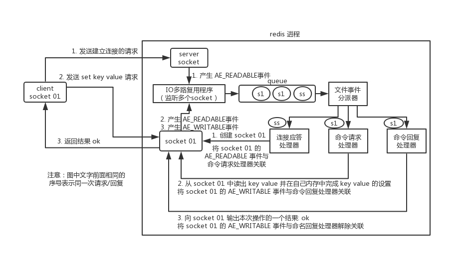

- [1 缓存](#1-缓存)
  - [1.1 缓存作用](#11-缓存作用)
  - [1.2 缓存带来的问题](#12-缓存带来的问题)
- [2 Redis基础](#2-Redis基础)
  - [2.1 Redis与Memcached区别](#21-Redis与Memcached区别)
  - [2.2 Redis数据结构](#22-Redis数据结构)
  - [2.3 Redis线程模型](#23-Redis线程模型)

# Redis总结

## 1 缓存

缓存指数据交换的缓冲区。

### 1.1 缓存作用

- **高性能**：预加载复杂、耗时且极少修改的查询，用户体验丝滑流畅
- **高并发**：内存中key-value式操作，单机支撑并发量达到几万十几万，是mysql的几十倍（因为缓存走内存，mysql走磁盘I/O）

### 1.2 缓存带来的问题

- 缓存与数据库双写不一致
- 缓存雪崩、缓存穿透、缓存击穿
- 缓存并发竞争

## 2 Redis基础

### 2.1 Redis与Memcached区别

| 区别     | Redis                                                        | Memcached              |
| -------- | ------------------------------------------------------------ | ---------------------- |
| 数据结构 | 支持string、hash、list、set、sorted set、bitmap、hyperloglog和geospatial等8种数据结构(5.0引入了stream) | 只支持String和整数     |
| 线程模型 | 单线程处理                                                   | 多线程处理             |
| 性能对比 | 100k以上数据性能较低，100k以下性能较高                       | 与其相反               |
| 部署模式 | 原生支持集群模式                                             | 原生仅支持单机部署模式 |
| 同步方式 | 支持主从同步                                                 | 不支持复制             |

### 2.2 Redis数据结构

**1. 基础数据结构**

- String
- hash
- list
- set
- sorted set

1）String

最简单的KV存储（效率比Memcached高）

> value也可以存数字，如：数字类型（数字类型可用Long表示时）

````
set name JeasonBourne
````

2）hash

类似map的数据结构

> 可存储结构化数据的同时只修改其中的部分属性，如：一个对象（对象中不能嵌套对象）

````
hset person name JeasonBourne
hset person age 25
hset person sex man
hget person age
````

````
person = {
	"name": "JeasonBourne",
	"age": 25,
	"sex": "man"
}
````

3）list

有序列表

> 可利用list存储列表型的数据结构，实现如存储粉丝列表、文章评论列表等

> 可通过lrange命令实现高性能分页，如微博下拉刷新的分页操作

````shell
# 0表示开始位置，-1表示结束位置，结束位置为-1时，表示列表的最后一个位置，即查看所有
lrange pageList 0 -1
````

> 可利用list存储的顺序结构，实现如简易版消息队列

````
lpush mqDemo 1
lpush mqDemo 2

rpop mqDemo
````

4）set

无序集合，自动去重

> 可利用set的交集、并集和差集操作，实现如两个好友间的共同好友、可能认识的人等

````shell
# 操作单个set
# 添加元素
sadd hisSet 1

# 查看全部元素
smembers hisSet

# 判断是否包含某个元素
sismember hisSet 1

# 删除某个/多个元素
srem hisSet 1
srem hisSet 2 4

# 查看元素个数
scard hisSet

# 随机删除一个元素
spop hisSet
````

````shell
# 操作多个set
# 将一个set的元素移动到另外一个set
smove yourSet hisSet 2

# 求两set的交集
sinter yourSet hisSet

# 求两set的并集
sunion yourSet hisSet

# 求在yourSet中而不在mySet中的元素
sdiff yourSet hisSet
````

5）sorted set

排序且去重的set（写入操作时给一个分数，自动根据分数排序，分数可重复，值会被去重）

> 可利用sorted set的排序去重特性，实现如排行榜、成绩排名等功能

````
zadd actors 85 JeasonBourne
zadd actors 72 MichaelScofield
zadd actors 96 TBAG
zadd actors 63 LincolnBurrows

# 获取排名前三的用户（默认是升序，所以需要 rev 改为降序）
zrevrange actors 0 3

# 获取某用户的排名
zrank actors TBAG
````

**2. 高级数据结构**

- bitmap
- hyperloglog
- GEO
- stream（Redis5.0+）

### 2.3 Redis线程模型

Redis的内部文件事件处理器 `file event handler` 是**单线程**的，所以Redis是单线程模型。

**1. 原理**

Redis的内部文件事件处理器采用 I/O 多路服用机制，同时监听多个 socket ，将产生时间的 socket 压入内存队列中，时间分派器根据 socket 上的事件类型来选择对应的事件处理器进行处理。

**2. 文件事件处理器组成**

- 多个socket
- I/O 多路复用程序
- 文件事件分派器
- 事件处理器（连接应答处理器、命令请求处理器、命令恢复处理器）

**3. Redis与客户端的通信过程**



①Redis 服务端进程初始化的时候，会将 server socket 的 `AE_READABLE` 事件与连接应答处理器关联。

②客户端 socket01 向 redis 进程的 server socket 请求建立连接，此时 server socket 会产生一个 `AE_READABLE` 事件，IO 多路复用程序监听到 server socket 产生的事件后，将该 socket 压入队列中。文件事件分派器从队列中获取 socket，交给**连接应答处理器**。连接应答处理器会创建一个能与客户端通信的 socket01，并将该 socket01 的 `AE_READABLE` 事件与命令请求处理器关联。

③假设此时客户端发送了一个 `set key value` 请求，此时 redis 中的 socket01 会产生 `AE_READABLE` 事件，IO 多路复用程序将 socket01 压入队列，此时事件分派器从队列中获取到 socket01 产生的 `AE_READABLE` 事件，由于前面 socket01 的 `AE_READABLE` 事件已经与命令请求处理器关联，因此事件分派器将事件交给命令请求处理器来处理。命令请求处理器读取 socket01 的 `key value` 并在自己内存中完成 `key value` 的设置。操作完成后，它会将 socket01 的 `AE_WRITABLE` 事件与命令回复处理器关联。

④如果此时客户端准备好接收返回结果了，那么 redis 中的 socket01 会产生一个 `AE_WRITABLE` 事件，同样压入队列中，事件分派器找到相关联的命令回复处理器，由命令回复处理器对 socket01 输入本次操作的一个结果，比如 `ok`，之后解除 socket01 的 `AE_WRITABLE` 事件与命令回复处理器的关联。

这就是Redis与客户端的一次通信过程。

**4. Redis单线程模型效率高的原因**

- 纯内存操作
- 核心是基于非阻塞的 I/O 多路服用机制
- C语言实现，执行速度快
- 单线程避免了多线程的频繁上下文切换的问题和多线程之间的竞争问题